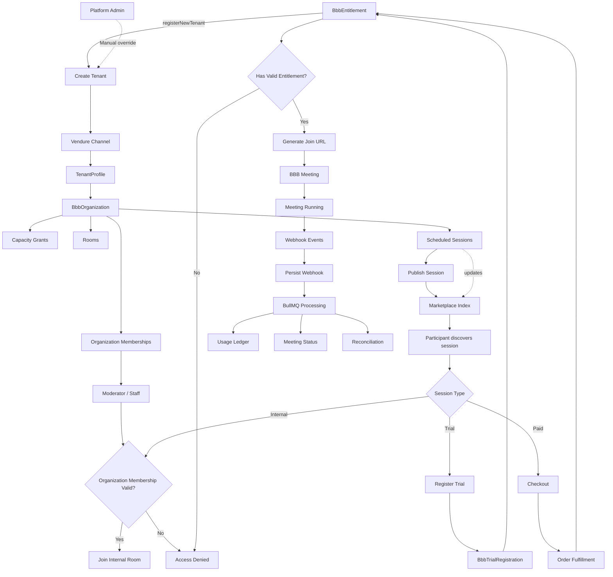
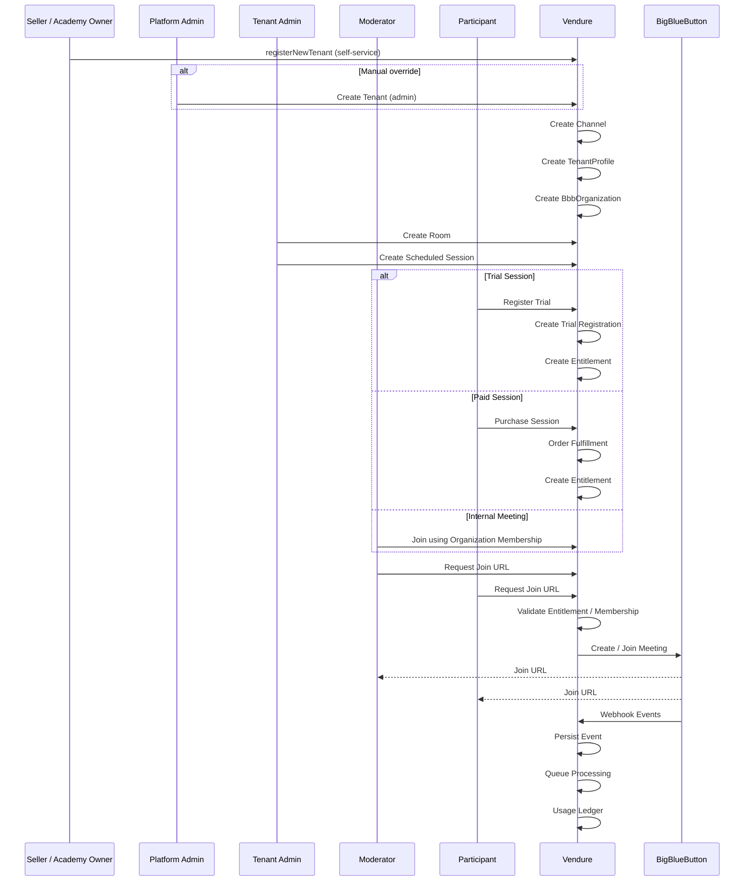

# Platform Story

> **Purpose:** Describe the platform from the perspective of each actor and business capability. Organized by lifecycle, not chronology.

---

## Seller Lifecycle

```
Academy discovers Saa9vi
  → Registers (registerNewTenant)
  → Creates organization (automatic)
  → Invites moderators (BbbOrganizationMembership)
  → Creates rooms (BbbRoom)
  → Schedules sessions (BbbScheduledSession)
  → Publishes sessions to marketplace
  → Runs live classes (BbbMeeting)
  → Gets usage billed (BbbUsageLedger)
```

### Academy owner self-registers

A coaching institute founder visits `marketplace.saa9vi.com` and calls `registerNewTenant` (public mutation). Vendure provisions a Seller, Channel, Role, Administrator, and TenantProfile in a single transaction. The `BbbOrganization` is created with the channel's `channelId` as a unique index, and a `BbbCapacityGrant` is issued. (Platform admin can also create tenants manually as an override path.)

**System/Code Detail:** `TenantRegistrationService.registerTenant()` — 5-step orchestration wrapped in `@Transaction()`.

### Trainer sets up content

The trainer creates `InstructorProfile` records, CMS pages, banners, BBB rooms, and scheduled sessions through the Admin UI. Slugs are unique per channel, not globally. The session's `productVariantId` field is the commercial bridge — it connects checkout to live class access.

---

## Participant Lifecycle

```
Finds session (storefront or marketplace)
  → Trial or Purchase
  → Entitlement created
  → Joins live class
  → Reviews after session
```

### Discovery

A student lands on `mehta.saa9vi.com`. Next.js middleware resolves the hostname to a channel token from Redis. Every GraphQL call carries that channel, and Vendure filters all results to that academy.

### Purchase → Entitlement

When the student buys a session, the order reaches `PaymentSettled`. `BbbOrderFulfillmentListener` catches the event, looks up the `BbbScheduledSession` by `productVariantId`, and calls `entitlementService.create({ type: "bbb_session" })`. For room products, it creates `BbbEntitlement { type: "bbb_room" }` instead.

### Trial

A student clicks "Join free trial". `TrialRegistrationService.register()` validates capacity, creates `BbbTrialRegistration`, and creates `BbbEntitlement { type: "bbb_session", source: "trial" }`.

### Join Live Class

`joinRoom()` runs a three-path auth check:
1. **Gate 1**: Organization membership (staff short-circuit)
2. **Gate 2**: Legacy BbbOrganizationMember check
3. **Gate 3**: `BbbEntitlement { type: 'bbb_room' }` check

If granted, `requestProvisioning()` acquires a distributed lock, transitions the room from Idle to Provisioning, and enqueues a BullMQ job. The worker selects the BBB server with the lowest `currentLoad`, resolves the earliest-expiring capacity grant, calls the BBB `createMeeting` API, encrypts passwords with AES-256-GCM, and writes the `grantId` to the meeting. The student gets a HMAC-signed join URL.

### Scheduled Session (Live Class) Start

Trainer calls `startScheduledSession(sessionId)` at the session start time. This is an **asynchronous provisioning request**, not an immediate live transition:

```
Trainer starts scheduled session
  → meeting provisioning requested (session remains SCHEDULED)
  → BullMQ worker provisions BBB meeting (createMeeting)
  → meeting becomes Active
  → session becomes LIVE (only on provisioning success)
  → learner authorization becomes joinable (canJoin = true, joinUrl available)
```

`startScheduledSession` creates a Pending meeting, links it, and enqueues provisioning without changing the session status. `BbbSessionProvisioningListener` transitions the session to LIVE on `MeetingProvisionedEvent` — the only place a session becomes LIVE. If BBB provisioning fails, the meeting becomes `Failed` and the session remains `SCHEDULED` (retryable via `retryBbbMeeting`). Join authorization requires both session status `LIVE` **and** the linked meeting state `Active`.

### Review

Five days after purchase, the review-request workflow prepares the notification intent. The student submits a review. `ReviewAntiFraudService` runs five checks (velocity, duplicate content, account age, rating pattern, unverified purchase). Score ≥ 50 auto-flags the review. When approved, `reviewAggregationService.recalculateForProduct()` updates `Product.customFields.reviewRating`.

> **Implementation note:** review-email services currently prepare/log the notification intent; actual delivery depends on the pending `@vendure/email-plugin` integration.

---

## Internal Staff Lifecycle

```
Staff member logs in
  → Enters internal team portal
  → Selects internal room (productVariantId = null)
  → Auth waterfall short-circuits on membership (Gate 1)
  → Joins as moderator
  → Usage written to internal_overhead grant
```

Internal rooms are `BbbRoom` entities with `productVariantId = null`. They are not Vendure products. Access is granted purely on the basis of organizational membership. The `BbbOrganizationMembership` entity with roles (`org_admin`, `moderator`, `staff`) controls access. Staff members receive moderator join URLs; regular staff receive viewer URLs.

---

## Marketplace Lifecycle

```
Student searches marketplace.saa9vi.com
  → MarketplaceSearchResolver queries ES index
  → Result links to tenant storefront
  → Student redirected to mehta.saa9vi.com
  → Commerce happens on tenant channel
  → CommissionLedger records row (even at 0%)
```

The marketplace is a **discovery layer only**. It does not transact. The platform-level Elasticsearch indices (`saa9vi_marketplace_sessions`, `saa9vi_marketplace_instructors`) are derived read projections. All writes (orders, entitlements, billing) go through channel-scoped Vendure Shop API.

**CommissionLedger $0-row pattern:** A commission row is written for every `orderSource = 'marketplace'` order regardless of the current `MARKETPLACE_COMMISSION_PERCENT` rate. When the rate is 0%, the row is written with `amountInPaise: 0` to preserve complete GMV history.

> **ⓘ Note:** `orderSource` is classified and stamped by Vendure-side logic from a signed opaque `marketplaceRef`. The server verifies the reference — HMAC signature, validity window, channel/resource relationship, and single-use replay constraint — before classification. The storefront never chooses `orderSource` directly (INV-008; ADR-021).

---

## Billing Lifecycle

```
Meeting ends
  → BBB fires meeting-ended webhook
  → BbbWebhookController persists event (INV-004)
  → BullMQ worker processes
  → completeMeetingLifecycle()
  → consumeGrantHours()
  → BbbUsageLedger row written (append-only, INV-002)
  → grant.consumedMinutes incremented
```

### Capacity Intelligence

Every 15 minutes, `CapacityIntelligenceService.buildDashboard()` computes live pool health, a 48-hour load forecast from scheduled session data, and a capacity recommendation. If urgency is `soon` or `immediate`, a `CapacityAlertEvent` is published. Meetings are **never blocked** for capacity reasons (INV-012).

### Reconciliation

Every 60 seconds, `BbbReconciliationService` runs three loops:
1. `reconcileActiveMeetings` — checks BBB `getMeetingInfo` for every Active meeting; marks stale if BBB has no record
2. `reconcileProvisioning` — resets or fails meetings stuck in Provisioning past timeout
3. `reconcileRooms` — fixes room/meeting state drift

---

## Three-Stream Revenue Model

| Stream | What it charges | Control mechanism | Ledger behavior |
|---|---|---|---|
| **1 — Tenant Billing** | BBB usage + portal/hosting | Always on (not a toggle) | `BbbUsageLedger` rows only on actual usage |
| **2 — Marketplace Commission** | % of marketplace order | `MARKETPLACE_COMMISSION_PERCENT` env var (default 0%) | `CommissionLedger` ALWAYS writes a row per marketplace order, even at 0% ($0 rows preserve GMV history) |
| **3 — Advertising** | Sponsored listings + banners | Opt-in, tenant-initiated via `AdWallet` top-up | `AdSpendLedger` rows only on actual impression/click/conversion |

---

## Workflow Diagram



---

## Sequence Diagram



---

## Known Gaps

- **Session provisioning state semantics** — `LIVE` now means "BBB provisioning succeeded" (not "trainer clicked start"). The session may remain `SCHEDULED` while its linked meeting is `Pending`/`Provisioning`. A true persisted session FSM (e.g. a `PROVISIONING` state with explicit transitions) is deferred — no migration yet. If a persisted intermediate state is introduced, use the Vendure CLI migration workflow.
- **Resolved: duplicate provisioning consumers** — `BbbMeetingService` is now **enqueue-only** (it delegates to `BbbProvisioningWorkerService.enqueueProvisioning`); the BBB provisioning queue has a **single** consumer (`BbbProvisioningWorkerService.doProvisionMeeting`) and a single implementation. The old queue field, dead `doProvisionMeeting`, and legacy imports were removed from `BBB_PROVISIONING_QUEUE` usage.
- **Entitlement channel stamping** — `createBbbEntitlement` now persists `channelId = ctx.channelId`; before this fix, admin-created entitlements had a null channel and were invisible to the shop's `hasAccess()` (which matches on channel), so learners with valid entitlements saw `canJoin=false`. Verified end-to-end.
- **Live-session lifecycle** — a session now transitions `LIVE → FINISHED` when its linked meeting completes (`MeetingCompletedEvent`, incl. a startup reconciliation pass for sessions left LIVE by earlier events).
- **Retry relink** — `retryBbbMeeting` now relinks any scheduled session whose `activeMeeting` was the failed meeting, so the provisioning listener still transitions the session to LIVE on retry.
- **BBB `getMeetingInfo` returning `error.forbidden`** (observed against `meeting.saa9vi.com`) blocks join-URL generation. The existence validator now treats only explicit `notFound` as "meeting gone" and otherwise fails open with a structured log. Exact BBB semantics for `error.forbidden` on provisioning-created rooms still need to be confirmed against the live BBB; a join can also be blocked legitimately if BBB auto-destroys an un-joined meeting (default expiry).

(Historical BUG-022/023 were fixed in v1.10–v1.11; see `docs/implementation/release-notes.md`.)
