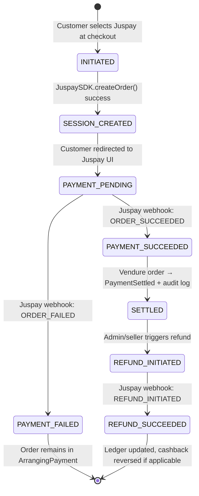
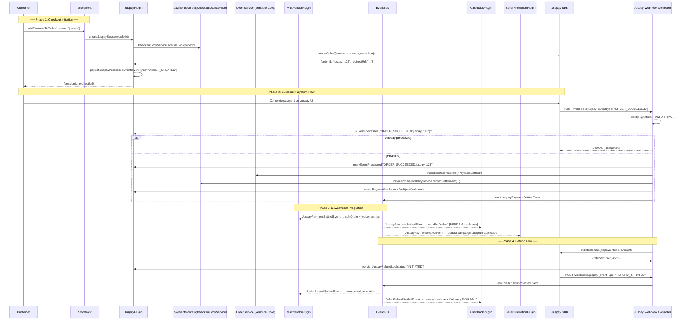

# 💳 Juspay Plugin for Vendure

> **Plugin Path:** `src/plugins/juspay-plugin`  
> **Status:** ✅ Production-Ready | **Compatibility:** Vendure 3.5.x | **Gateway:** Juspay Hyperlocal

A production-grade payment gateway integration for the Buylits multi-vendor marketplace. Provides secure checkout session management, idempotent webhook processing, reconciliation jobs, and seamless integration with the platform's financial correctness layer via `payments-core`.

---

## 🎯 Overview

The Juspay Plugin bridges Vendure's order management with the Juspay payment gateway, enabling:

| Feature | Description |
|---------|-------------|
| **Checkout Session Management** | Create and manage Juspay checkout sessions with order metadata, customer details, and return URLs |
| **Idempotent Webhook Processing** | Handle `ORDER_SUCCEEDED`, `ORDER_FAILED`, `REFUND_INITIATED` events with signature verification and duplicate prevention |
| **Payment Settlement Flow** | Transition Vendure orders to `PaymentSettled` only after gateway confirmation and internal audit logging |
| **Refund Orchestration** | Process seller and platform refunds via Juspay API with webhook confirmation and ledger updates |
| **Reconciliation Jobs** | Scheduled BullMQ jobs to detect and repair payment state drift between Vendure and Juspay |
| **Observability & Audit** | `PaymentSettlementAudit` and `JuspayProcessedEvent` entities for full payment lifecycle tracing |
| **Multi-Vendor Support** | Integrates with `MultivendorPlugin` to correctly split payments and calculate platform fees |
| **Cashback Integration** | Emits `JuspayPaymentSettledEvent` to trigger cashback earning in `CashbackPlugin` |
| **Promotion Billing** | Supports `SellerPromotionPlugin` billing via Juspay for campaign budget top-ups |

---

## 🏗️ Architecture

### Core Components

```
juspay-plugin/
├── api/
│   ├── juspay-admin.resolver.ts       # Admin: reconciliation, audit queries
│   ├── juspay-shop.resolver.ts        # Shop: checkout session creation
│   └── api-extensions.ts              # GraphQL schema extensions
├── entity/
│   ├── juspay-processed-event.entity.ts   # Idempotency log for webhook events
│   ├── payment-settlement-audit.entity.ts # Audit trail for payment settlement
│   └── juspay-refund-log.entity.ts        # Refund request/response tracking
├── service/
│   ├── juspay.service.ts              # Core Juspay SDK integration + session management
│   ├── juspay-webhook.service.ts      # Webhook signature verification + event parsing
│   ├── juspay-reconciliation.service.ts # Drift detection + repair jobs
│   └── juspay-refund.service.ts       # Refund initiation + status tracking
├── listener/
│   ├── juspay-payment.listener.ts     # Listens to OrderStateTransition for payment init
│   └── juspay-webhook.listener.ts     # Processes inbound webhook events
├── jobs/
│   └── juspay-reconciliation.job.ts   # BullMQ handler for periodic reconciliation
├── controller/
│   └── juspay-webhook.controller.ts   # POST /webhooks/juspay endpoint
├── config/
│   ├── juspay-payment-handler.ts      # Vendure PaymentMethodHandler implementation
│   └── juspay-strategy.ts             # Configurable payment flow strategies
├── events/
│   ├── juspay-payment-settled.event.ts    # Published on successful settlement
│   └── seller-refund-settled.event.ts     # Published on confirmed seller refund
├── ui/
│   ├── juspay-audit-list.component.ts # Admin: payment audit trail viewer
│   └── juspay-reconciliation-widget.component.ts # Admin: drift monitoring widget
├── constants.ts                       # Tokens, permissions, job names
├── juspay.plugin.ts                   # Plugin bootstrap & configuration
└── types.ts                           # Shared TypeScript interfaces + webhook payloads
```

### Payment Lifecycle State Machine



### Plugin Interaction Flow



---

## 📦 Installation & Setup

### 1. Add to `vendure-config.ts`

```ts
import { JuspayPlugin } from './plugins/juspay-plugin';
import { PaymentsCoreModule } from './plugins/payments-core';
import { MultivendorPlugin } from './plugins/multivendor-plugin';

export const config: VendureConfig = {
  // ...
  plugins: [
    // Load payments-core FIRST (provides shared SDK + services)
    PaymentsCoreModule.init({
      redis: {
        host: process.env.REDIS_HOST ?? 'localhost',
        port: parseInt(process.env.REDIS_PORT ?? '6379'),
      },
    }),
    
    // Load MultivendorPlugin before JuspayPlugin for order splitting
    MultivendorPlugin.init({ /* mv options */ }),
    
    // Configure JuspayPlugin
    JuspayPlugin.init({
      // Juspay merchant credentials
      merchantId: process.env.JUSPAY_MERCHANT_ID!,
      apiKey: process.env.JUSPAY_API_KEY!,
      
      // Environment: 'sandbox' for testing, 'production' for live
      environment: process.env.JUSPAY_ENVIRONMENT ?? 'sandbox',
      
      // Webhook configuration
      webhookSecret: process.env.JUSPAY_WEBHOOK_SECRET!,
      webhookEndpoint: '/webhooks/juspay',
      
      // Payment flow settings
      defaultCurrency: 'INR',
      paymentTimeoutMs: 30_000, // Timeout for Juspay API calls
      
      // Reconciliation settings
      reconciliationCron: '0 */6 * * *', // Every 6 hours
      maxReconciliationAttempts: 3,
      
      // Enable verbose logging for payment debugging
      debug: process.env.NODE_ENV === 'development',
    }),
  ],
  
  // Required custom fields on Payment entity
  customFields: {
    Payment: [
      {
        name: 'juspayOrderId',
        type: 'string',
        nullable: true,
        public: false,
      },
      {
        name: 'juspaySessionId',
        type: 'string',
        nullable: true,
        public: false,
      },
      {
        name: 'settlementVerified',
        type: 'boolean',
        defaultValue: false,
        public: false,
      },
    ],
  },
};
```

### 2. Database Migration

The plugin registers three entities:

```ts
// juspay.plugin.ts
entities: [
  JuspayProcessedEvent,    // Idempotency log
  PaymentSettlementAudit,  // Settlement audit trail
  JuspayRefundLog,         // Refund tracking
],
```

Run migrations:
```bash
npx vendure migrate
```

### 3. Payment Method Registration

Register Juspay as a payment method in Vendure Admin or via GraphQL:

```graphql
mutation CreateJuspayPaymentMethod {
  createPaymentMethod(
    input: {
      code: "juspay"
      handler: {
        code: "juspay-payment-handler"
        arguments: [
          { name: "merchantId", value: "your_merchant_id" },
          { name: "apiKey", value: "your_api_key" }
        ]
      }
      name: "Juspay"
      description: "Pay securely via Juspay"
      enabled: true
    }
  ) {
    id
    code
    enabled
  }
}
```

---

## ⚙️ Configuration

```ts
export interface JuspayPluginOptions {
  /**
   * Juspay merchant ID (required)
   */
  merchantId: string;

  /**
   * Juspay API key (required)
   */
  apiKey: string;

  /**
   * Environment: 'sandbox' or 'production'
   * @default 'sandbox'
   */
  environment?: 'sandbox' | 'production';

  /**
   * Shared secret for verifying inbound webhook signatures (HMAC-SHA256)
   */
  webhookSecret: string;

  /**
   * Public webhook endpoint path (relative to API base)
   * @default '/webhooks/juspay'
   */
  webhookEndpoint?: string;

  /**
   * Default currency code for all transactions
   * @default 'INR'
   */
  defaultCurrency?: string;

  /**
   * HTTP timeout for Juspay API calls (milliseconds)
   * @default 30000
   */
  paymentTimeoutMs?: number;

  /**
   * Cron expression for reconciliation job
   * @default '0 */6 * * *' (every 6 hours)
   */
  reconciliationCron?: string;

  /**
   * Maximum retry attempts for failed reconciliation jobs
   * @default 3
   */
  maxReconciliationAttempts?: number;

  /**
   * Enable verbose logging for payment debugging
   * @default false
   */
  debug?: boolean;

  /**
   * Optional: Custom headers for all Juspay API requests
   */
  additionalHeaders?: Record<string, string>;
}
```

---

## 🔌 API Reference

### Admin GraphQL Extensions

| Query/Mutation | Description | Permission |
|----------------|-------------|------------|
| `juspayPaymentAudit(orderId)` | View settlement audit trail for an order | `ReadOrder` |
| `juspayReconciliationStats(period)` | View reconciliation success/failure metrics | `ReadOrder` |
| `manualReconcilePayment(input)` | Trigger manual reconciliation for a payment | `SuperAdmin` |
| `listJuspayProcessedEvents(filter)` | Query idempotency log for debugging | `SuperAdmin` |

### Shop GraphQL Extensions

| Query/Mutation | Description |
|----------------|-------------|
| `createJuspaySession(orderId)` | Create a new Juspay checkout session for an order |
| `getJuspaySessionStatus(sessionId)` | Poll session status while customer is on Juspay UI |
| `initiateJuspayRefund(orderId, amountPaise, reason)` | Request refund via Juspay (seller/admin only) |

### Example: Create Checkout Session (Shop API)

```graphql
mutation CreateJuspayCheckout($orderId: ID!) {
  createJuspaySession(orderId: $orderId) {
    ... on JuspaySessionCreated {
      sessionId
      redirectUrl
      expiresAt
    }
    ... on ErrorResult {
      errorCode
      message
    }
    ... on PaymentFailedError {
      paymentErrorMessage
    }
  }
}
```

### Example: Query Settlement Audit (Admin API)

```graphql
query GetPaymentAudit($orderId: ID!) {
  juspayPaymentAudit(orderId: $orderId) {
    orderId
    juspayOrderId
    amount
    currency
    status          # "SETTLED" | "FAILED" | "REFUNDED"
    verified        # true if audit passed all checks
    verifiedAt
    metadata {
      gatewayResponse
      riskScore
      settlementBatch
    }
  }
}
```

---

## 📡 Event System

### Incoming Events (Subscribed)

| Event | Source | Action |
|-------|--------|--------|
| `OrderStateTransitionEvent` (ArrangingPayment) | Vendure Core | Initialize Juspay session when customer selects payment method |
| `OrderStateTransitionEvent` (Cancelled) | Vendure Core | Trigger refund flow if payment was already settled |

### Outgoing Events (Published)

| Event | Payload Highlights | Consumers |
|-------|-------------------|-----------|
| `JuspayPaymentSettledEvent` | `{ ctx, orderId, paymentId, juspayOrderId, amountMinorUnits, currency }` | `MultivendorPlugin` (order split), `CashbackPlugin` (earn PENDING), `SellerPromotionPlugin` (budget deduction) |
| `SellerRefundSettledEvent` | `{ ctx, orderId, refundId, amountMinorUnits, sellerId? }` | `MultivendorPlugin` (ledger reversal), `CashbackPlugin` (cashback reversal) |

> 💡 All events are published via Vendure `EventBus` for loose coupling. Downstream plugins subscribe without tight dependencies.

---

## 🔐 Webhook Security & Idempotency

### Signature Verification

Inbound webhooks from Juspay are secured via HMAC-SHA256:

```ts
// juspay-webhook.controller.ts
async verifySignature(rawBody: Buffer, signature: string): Promise<boolean> {
  const expected = createHmac('sha256', this.webhookSecret)
    .update(rawBody)
    .digest('hex');
  return timingSafeEqual(Buffer.from(signature), Buffer.from(expected));
}
```

### Idempotency via Dual-Layer Logging

The plugin implements two layers of idempotency to prevent duplicate processing:

1. **Cross-Plugin Idempotency** (`payments-core.PaymentEventLog`):
   ```ts
   // Key format: 'juspay:{event_type}:{juspay_order_id}'
   const key = `juspay:ORDER_SUCCEEDED:${payload.order_id}`;
   const alreadyProcessed = await this.paymentEventLogService.isProcessed(key);
   if (alreadyProcessed) return; // Early exit, idempotent
   ```

2. **Plugin-Specific Idempotency** (`JuspayProcessedEvent`):
   ```ts
   // Additional metadata for debugging and replay
   await this.connection.getRepository(ctx, JuspayProcessedEvent).save({
     eventType: payload.event_type,
     juspayOrderId: payload.order_id,
     vendureOrderId: order.id,
     processedAt: new Date(),
     payload: JSON.stringify(payload),
   });
   ```

### Raw Body Preservation

Critical: The webhook endpoint must preserve the raw request body for signature verification:

```ts
// In vendure-config.ts middleware configuration
middleware: [
  {
    route: '/webhooks/juspay',
    handler: (req, res, next) => {
      // Preserve raw body before JSON parsing
      let rawBody = Buffer.from('');
      req.on('data', chunk => { rawBody = Buffer.concat([rawBody, chunk]); });
      req.on('end', () => {
        (req as any).rawBody = rawBody;
        next();
      });
    },
  },
],
```

---

## 🔗 Integration Points

| Plugin | Integration Type | Details |
|--------|-----------------|---------|
| `PaymentsCoreModule` | Dependency | Shared `CheckoutLockService` (Redis idempotency), `PaymentObservabilityService`, Juspay SDK client |
| `MultivendorPlugin` | Event Consumer | `JuspayPaymentSettledEvent` triggers order splitting, platform fee calculation, and seller ledger entries |
| `CashbackPlugin` | Event Consumer | `JuspayPaymentSettledEvent` triggers PENDING cashback earning; `SellerRefundSettledEvent` triggers reversal |
| `SellerPromotionPlugin` | Event Consumer | `JuspayPaymentSettledEvent` may deduct campaign budget if order qualifies for promotion billing |
| `DriverFulfillmentPlugin` | Indirect | Payment settlement is prerequisite for dispatch job enqueue (via `CommerceOpsPlugin` readiness gate) |

### Critical Integration: Order Splitting & Fee Calculation

When `JuspayPaymentSettledEvent` is emitted:

1. `MultivendorPlugin` receives the event and:
   - Groups order lines by seller channel
   - Calculates platform fee surcharge per seller sub-order
   - Creates `SellerLedgerEntry` records with `idempotencyKey = "juspay:{orderId}:{sellerId}"`
   - Emits `SellerOrderCreatedEvent` for each sub-order

2. Platform fees are **excluded** from cashback earn base:
   ```ts
   // In CashbackPlugin: calculateEarn()
   const earnBase = order.subTotal - order.platformFeePaise;
   const earnAmount = policy.rateType === 'PERCENTAGE'
     ? Math.floor(earnBase * policy.rateValue / 100)
     : policy.rateValue;
   ```

3. All ledger operations use pessimistic locking to prevent race conditions during high-volume sales.

---

## 🛡️ Permissions & Security

| Permission | Scope | Usage |
|------------|-------|---------|
| `ProcessJuspayPayments` | Channel | Allow payment method to be used at checkout |
| `ManageJuspayReconciliation` | Global | Access reconciliation dashboard, trigger manual repairs |
| `ViewPaymentAudit` | Global | View `PaymentSettlementAudit` records for compliance |
| `SuperAdmin` | Global | Override settlement status, force event replay |

Custom permissions are auto-registered:

```ts
// juspay.plugin.ts
configuration: (config) => {
  config.authOptions.customPermissions = [
    ...(config.authOptions.customPermissions ?? []),
    ProcessJuspayPaymentsPermission,
    ManageJuspayReconciliationPermission,
    ViewPaymentAuditPermission,
  ];
  return config;
}
```

### Checkout Locking (Prevent Double-Charge)

All payment initiation flows use Redis-based distributed locking via `payments-core.CheckoutLockService`:

```ts
// juspay.service.ts
async createSession(ctx: RequestContext, orderId: ID): Promise<JuspaySession> {
  const lockKey = `checkout_lock:${orderId}`;
  const lock = await this.checkoutLockService.acquireLock(lockKey, { ttl: 30_000 });
  
  if (!lock.acquired) {
    throw new Error('Checkout already in progress for this order');
  }
  
  try {
    // ... create Juspay session
    return session;
  } finally {
    await this.checkoutLockService.releaseLock(lock);
  }
}
```

---

## 📝 Business Rules & Edge Cases

### 1. Payment Settlement Verification

A payment is only marked `SETTLED` after **all** checks pass:

```ts
// juspay-webhook.service.ts
async verifySettlement(payload: JuspayWebhookPayload, order: Order): Promise<SettlementVerification> {
  const checks = [
    // Amount match (minor units)
    payload.amount === order.totalWithTax,
    // Currency match
    payload.currency === order.currencyCode,
    // Order not already settled
    !order.payments.some(p => p.state === 'Settled'),
    // Signature verified (done earlier in controller)
    this.signatureVerified,
  ];
  
  if (!checks.every(Boolean)) {
    return { verified: false, failures: checks.map((ok, i) => ok ? null : `CHECK_${i}`) };
  }
  
  return { verified: true };
}
```

### 2. Refund Authorization Logic

Refunds can only be initiated if:

- ✅ Order payment state = `Settled`
- ✅ Refund amount ≤ original payment amount
- ✅ For partial refunds: remaining refundable amount > 0
- ✅ Seller has `ManageSellerRefunds` permission (for seller-initiated refunds)
- ✅ Platform admin has `SuperAdmin` permission (for platform-initiated refunds)

### 3. Reconciliation Drift Detection

The reconciliation job detects and repairs these drift scenarios:

| Drift Type | Detection Logic | Repair Action |
|------------|----------------|---------------|
| **Settled in Juspay, not in Vendure** | `JuspayProcessedEvent` exists with `ORDER_SUCCEEDED` but order state ≠ `PaymentSettled` | Re-play settlement logic, emit `JuspayPaymentSettledEvent` |
| **Refunded in Juspay, not in Vendure** | `JuspayRefundLog` shows `REFUND_SUCCEEDED` but ledger not reversed | Re-play refund logic, emit `SellerRefundSettledEvent` |
| **Duplicate webhook processing** | Multiple `JuspayProcessedEvent` with same `eventType + juspayOrderId` | Log warning, no action (idempotency worked) |
| **Amount mismatch** | `PaymentSettlementAudit.amount ≠ order.totalWithTax` | Flag for manual review, emit `SyncIncident` |

### 4. Timeout & Retry Handling

```ts
// juspay.service.ts - createOrder with retry
async createOrderWithRetry(ctx: RequestContext, order: Order, maxRetries = 3): Promise<JuspayOrderResponse> {
  let lastError: Error;
  
  for (let attempt = 1; attempt <= maxRetries; attempt++) {
    try {
      return await this.juspaySdk.createOrder({
        merchantId: this.merchantId,
        amount: order.totalWithTax,
        currency: order.currencyCode,
        orderId: `vendure_${order.code}`,
        // ... metadata
      }, { timeout: this.paymentTimeoutMs });
    } catch (err) {
      lastError = err;
      if (attempt < maxRetries && this.isRetryableError(err)) {
        await new Promise(res => setTimeout(res, 1000 * attempt)); // Exponential backoff
        continue;
      }
      throw err;
    }
  }
  
  throw lastError!;
}
```

---

## 🐛 Troubleshooting

| Issue | Diagnostic Steps | Solution |
|-------|-----------------|----------|
| Webhook signature verification fails | 1. Confirm `webhookSecret` matches Juspay dashboard<br>2. Check raw body is preserved before JSON parsing<br>3. Verify HMAC algorithm (SHA256) and encoding (hex) | Use `body-parser` with `verify` option; log raw body hash for debugging |
| Payment settled but order not split | 1. Check `JuspayPaymentSettledEvent` was published<br>2. Verify `MultivendorPlugin` is loaded after JuspayPlugin<br>3. Review `SellerLedgerService` logs for idempotency key conflicts | Ensure plugin load order: `payments-core` → `multivendor` → `juspay` |
| Cashback not earned after payment | 1. Confirm `JuspayPaymentSettledEvent` payload includes `orderId`<br>2. Check `CashbackPlugin` listener is subscribed<br>3. Verify seller has active cashback policy | Enable `debug: true` in JuspayPlugin to trace event flow |
| Reconciliation job stuck in "processing" | 1. Check BullMQ queue status in Admin UI<br>2. Verify Redis connection for lock acquisition<br>3. Review `maxReconciliationAttempts` config | Increase `reconciliationCron` interval; add dead-letter queue monitoring |
| Duplicate charges reported by customer | 1. Audit `PaymentEventLog` for duplicate keys<br>2. Check `CheckoutLockService` Redis TTL config<br>3. Review frontend retry logic on network errors | Ensure lock TTL > max expected payment flow duration; implement frontend idempotency tokens |

### Debug Mode

Enable verbose logging for payment flows:

```ts
// vendure-config.ts
JuspayPlugin.init({
  debug: process.env.NODE_ENV === 'development',
})
```

Logs appear under `[JuspayPlugin]` with session IDs and webhook event IDs for traceability.

### Health Checks

The plugin exposes a health endpoint for load balancers:

```ts
// GET /health/juspay
{
  "status": "ok",
  "checks": {
    "juspayApiReachable": true,
    "webhookEndpointConfigured": true,
    "redisLockServiceConnected": true,
    "reconciliationQueueHealthy": true
  }
}
```

---

## 🧪 Testing

### Unit Tests

```bash
# Run juspay plugin tests
npm run test -- juspay-plugin

# Watch mode for webhook service
npm run test:watch -- juspay-webhook.service
```

### E2E Test Scenarios

The plugin includes test suites for:

1. **Session Creation** – Juspay API mock + lock acquisition
2. **Webhook Processing** – Signature verification + idempotency + settlement
3. **Refund Flow** – Initiate refund + webhook confirmation + ledger reversal
4. **Reconciliation Job** – Drift detection + repair + audit logging
5. **Concurrency Safety** – Simultaneous payment attempts on same order

Example test:
```ts
// juspay-webhook.e2e-spec.ts
it('should settle payment and emit JuspayPaymentSettledEvent on ORDER_SUCCEEDED', async () => {
  const order = await createTestOrder({ totalWithTax: 10000, currencyCode: 'INR' });
  
  // Simulate Juspay webhook
  const payload = {
    event_type: 'ORDER_SUCCEEDED',
    order_id: 'juspay_test_123',
    amount: 10000,
    currency: 'INR',
  };
  
  await request(app.getHttpServer())
    .post('/webhooks/juspay')
    .set('X-Juspay-Signature', createSignature(payload, secret))
    .send(payload);
  
  // Verify order state transitioned
  const updatedOrder = await getOrder(order.id);
  expect(updatedOrder.state).toBe('PaymentSettled');
  
  // Verify event was published
  const events = await getPublishedEvents(JuspayPaymentSettledEvent);
  const settledEvent = events.find(e => e.orderId === order.id);
  expect(settledEvent?.amountMinorUnits).toBe(10000);
});
```

### Sandbox Testing

Use Juspay's sandbox environment for end-to-end testing:

```bash
# .env.test
JUSPAY_ENVIRONMENT=sandbox
JUSPAY_MERCHANT_ID=test_merchant_123
JUSPAY_API_KEY=test_key_456
JUSPAY_WEBHOOK_SECRET=test_secret_789
```

Sandbox webhooks can be triggered manually via Juspay dashboard or CLI.

---

## 📊 Monitoring & Observability

### Key Metrics (Prometheus-compatible)

```ts
// Exposed via /metrics when telemetry-plugin is active
juspay_sessions_created_total{environment="sandbox|production"}  // Counter
juspay_webhooks_received_total{event_type="ORDER_SUCCEEDED|ORDER_FAILED|..."}  // Counter
juspay_settlement_latency_seconds  // Histogram: webhook received → settlement complete
juspay_reconciliation_drifts_detected{type="..."}  // Counter: drifts by category
juspay_refunds_initiated_total{initiator="seller|admin"}  // Counter
```

### Admin Dashboard Widgets

Pre-built cards for payment ops monitoring:

- **Settlement Success Rate (24h)**: % of `ORDER_SUCCEEDED` webhooks that resulted in `PaymentSettled`
- **Avg Settlement Latency**: Median time from webhook receipt to order state transition
- **Reconciliation Health**: Count of unresolved drifts requiring manual review
- **Refund Volume**: Total refunded amount (paise) split by seller/platform

### Audit Trail Queries

Use these GraphQL queries for compliance and debugging:

```graphql
# Find all settlements for a date range
query SettlementAudit($from: DateTime!, $to: DateTime!) {
  juspayPaymentAudits(from: $from, to: $to) {
    orderId
    juspayOrderId
    amount
    verified
    verifiedAt
    metadata { settlementBatch }
  }
}

# Find unverified settlements requiring review
query UnverifiedSettlements {
  juspayPaymentAudits(verified: false) {
    orderId
    amount
    metadata { failures }
  }
}
```

---

## 🔄 Migration Guide: From Legacy Payment Plugin

If migrating from a custom `LegacyPaymentPlugin`:

### Breaking Changes

| Legacy Pattern | New Pattern | Migration Step |
|---------------|-------------|---------------|
| Inline webhook handling in resolver | Dedicated `InboundWebhookController` + service layer | Move logic to controller; update route config |
| Manual idempotency via database flags | Dual-layer: `PaymentEventLog` + `JuspayProcessedEvent` | Add migration to backfill idempotency keys |
| Direct Juspay SDK calls in service | Shared SDK via `payments-core` | Update imports; remove duplicate SDK initialization |
| No reconciliation job | BullMQ-based `juspay-reconciliation.job` | Configure cron; test drift detection scenarios |

### Data Migration

```sql
-- Backfill idempotency keys for existing payments
INSERT INTO payment_event_log (key, processed_at, metadata)
SELECT 
  CONCAT('juspay:ORDER_SUCCEEDED:', p.customFields.juspayOrderId),
  p.updatedAt,
  json_build_object('migrated', true, 'legacy_payment_id', p.id)
FROM payment p
WHERE p.method = 'juspay'
  AND p.state = 'Settled'
  AND p.customFields.juspayOrderId IS NOT NULL
ON CONFLICT (key) DO NOTHING;
```

---

## 📄 License

MIT © Buylits Marketplace

---

> 🔗 **Part of the Buylits Hyperlocal Stack**  
> This plugin is designed to work seamlessly with:
> - `payments-core` – Shared SDK, Redis locking, observability
> - `multivendor-plugin` – Order splitting, ledger entries, payout orchestration
> - `cashback-plugin` – Payment-triggered reward earning and refund reversal
> - `seller-promotion-plugin` – Campaign budget deduction on settled orders
> - `@pinelab/vendure-plugin-webhook` – Alternative outbound webhook pattern (if needed)
> 
> Refer to the [Platform README](../../README.md) for end-to-end architecture details and the [Pinelab Webhook Plugin docs](https://github.com/Pinelab-studio/pinelab-vendure-plugins/tree/main/packages/vendure-plugin-webhook) for webhook best practices.