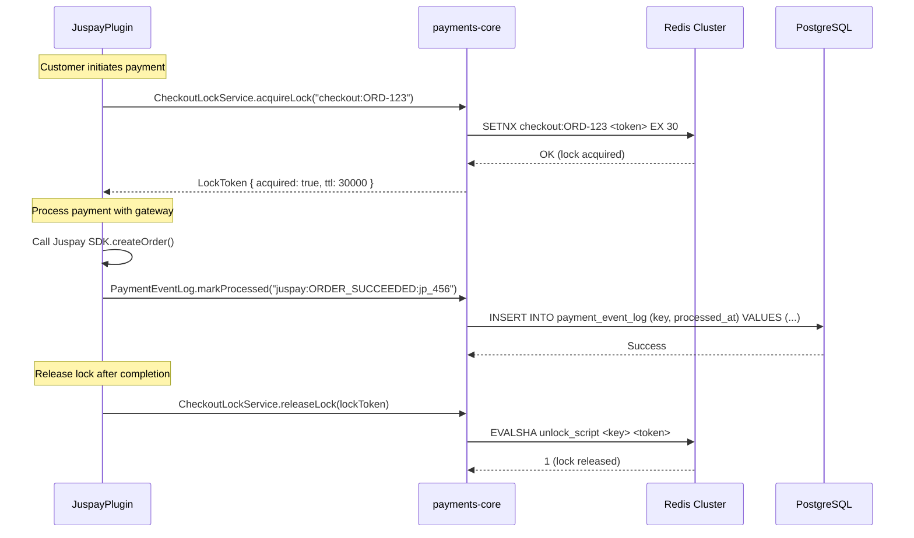
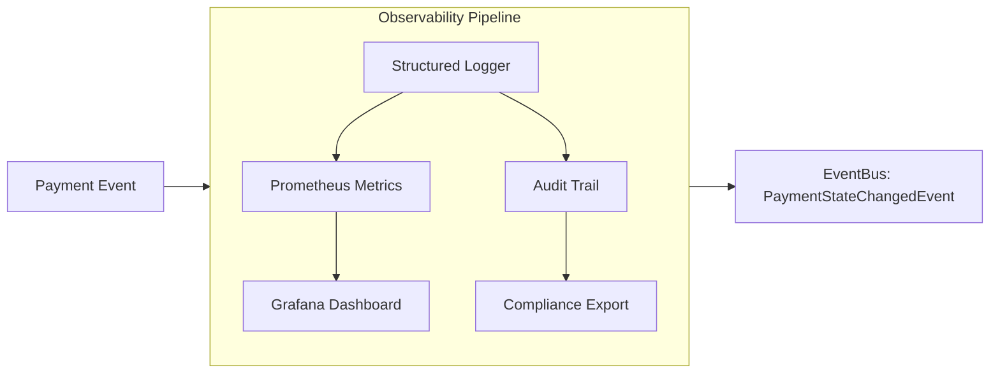

# 🔐 Payments Core Module for Vendure

> **Plugin Path:** `src/plugins/payments-core`  
> **Status:** ✅ Production-Ready | **Compatibility:** Vendure 3.5.x | **Type:** Shared Infrastructure Module

A foundational infrastructure module providing payment safety primitives for the Buylits multi-vendor marketplace. Delivers Redis-based checkout idempotency, payment observability instrumentation, and shared SDK integration for gateway plugins like `JuspayPlugin`.

---

## 🎯 Overview

The Payments Core Module is **not a standalone payment plugin**—it is a shared infrastructure layer that other payment plugins depend on. It provides:

| Feature | Description |
|---------|-------------|
| **CheckoutLockService** | Redis-based distributed locking to prevent double-charges and race conditions during payment initiation |
| **PaymentObservabilityService** | Structured logging and metrics emission for payment lifecycle events (initiated, settled, failed, refunded) |
| **Shared Juspay SDK** | Pre-configured, version-pinned Juspay client with retry logic, timeout handling, and environment-aware endpoints |
| **PaymentEventLog Entity** | Cross-plugin idempotency table with key format `{gateway}:{event_type}:{order_id}` to prevent duplicate event processing |
| **Type-Safe Interfaces** | Shared TypeScript types for payment payloads, webhook events, and settlement audits |
| **Redis Connection Factory** | Centralized ioredis configuration with TLS, retry, and connection pooling defaults |

> 💡 **Key Design Principle:** This module follows the **Infrastructure-as-Dependency** pattern. Payment gateway plugins (e.g., `JuspayPlugin`) import services from `payments-core` rather than implementing their own locking, logging, or SDK wrappers.

---

## 🏗️ Architecture

### Core Components

```
payments-core/
├── entity/
│   └── payment-event-log.entity.ts    # Shared idempotency log (cross-plugin)
├── service/
│   ├── checkout-lock.service.ts       # Redis distributed lock wrapper
│   └── payment-observability.service.ts # Metrics + structured logging
├── sdk/
│   └── juspay-sdk.ts                  # Pre-configured Juspay client (optional)
├── types.ts                           # Shared payment interfaces + webhook payloads
├── constants.ts                       # DI tokens, error codes, metric names
├── payments-core.module.ts            # NestJS module bootstrap
└── index.ts                           # Public API exports
```

### Idempotency Architecture



### Event Observability Flow



---

## 📦 Installation & Setup

### 1. Add to `vendure-config.ts`

```ts
import { PaymentsCoreModule } from './plugins/payments-core';
import { JuspayPlugin } from './plugins/juspay-plugin';

export const config: VendureConfig = {
  // ...
  plugins: [
    // Load PaymentsCoreModule FIRST - other payment plugins depend on it
    PaymentsCoreModule.init({
      redis: {
        host: process.env.REDIS_HOST ?? 'localhost',
        port: parseInt(process.env.REDIS_PORT ?? '6379'),
        // Production TLS settings
        tls: process.env.NODE_ENV === 'production' ? {
          rejectUnauthorized: true,
          // Optional: CA certificate for self-signed certs
          // ca: fs.readFileSync(process.env.REDIS_CA_CERT_PATH),
        } : undefined,
        // Connection resilience
        retryStrategy: (times: number) => Math.min(times * 50, 2000),
        maxRetriesPerRequest: 3,
      },
      // Optional: Enable verbose observability logging
      debugObservability: process.env.NODE_ENV === 'development',
    }),
    
    // Payment gateway plugins load AFTER payments-core
    JuspayPlugin.init({ /* juspay options */ }),
  ],
};
```

### 2. Database Migration

The module registers one shared entity used by all payment plugins:

```ts
// payments-core.module.ts
entities: [PaymentEventLog],
```

Run migrations:
```bash
npx vendure migrate
```

### 3. Required Custom Fields (on Payment Entity)

Add these fields to `config.customFields.Payment` for full observability:

```ts
customFields: {
  Payment: [
    {
      name: 'gatewayTransactionId',
      type: 'string',
      nullable: true,
      public: false,
    },
    {
      name: 'settlementVerified',
      type: 'boolean',
      defaultValue: false,
      public: false,
    },
    {
      name: 'idempotencyKey',
      type: 'string',
      nullable: true,
      public: false,
    },
  ],
}
```

---

## ⚙️ Configuration

```ts
export interface PaymentsCoreOptions {
  /**
   * Redis connection configuration for checkout locking and caching
   */
  redis: {
    host: string;
    port: number;
    password?: string;
    db?: number;
    tls?: {
      rejectUnauthorized: boolean;
      ca?: Buffer;
      cert?: Buffer;
      key?: Buffer;
    };
    /**
     * Retry strategy for Redis connection failures
     * @default (times) => Math.min(times * 50, 2000)
     */
    retryStrategy?: (times: number) => number | null;
    /**
     * Max retries per request before failing
     * @default 3
     */
    maxRetriesPerRequest?: number;
  };

  /**
   * Enable verbose logging for payment observability
   * @default false
   */
  debugObservability?: boolean;

  /**
   * Default TTL for checkout locks (milliseconds)
   * @default 30000
   */
  defaultLockTtlMs?: number;

  /**
   * Prometheus metric prefix for payment events
   * @default 'vendure_payment'
   */
  metricPrefix?: string;
}
```

---

## 🔌 API Reference

### Services (Injectable)

| Service | Method | Description |
|---------|--------|-------------|
| `CheckoutLockService` | `acquireLock(key: string, options?: LockOptions)` | Acquire Redis distributed lock; returns `LockToken` or `{ acquired: false }` |
| `CheckoutLockService` | `releaseLock(token: LockToken)` | Release lock using Lua script for atomicity |
| `CheckoutLockService` | `extendLock(token: LockToken, additionalTtlMs: number)` | Extend lock TTL for long-running payment flows |
| `PaymentObservabilityService` | `recordPaymentInitiated(ctx, payment)` | Log payment start + emit `payment_initiated_total` metric |
| `PaymentObservabilityService` | `recordPaymentSettled(ctx, payment, gatewayResponse)` | Log settlement + emit latency histogram + audit trail |
| `PaymentObservabilityService` | `recordPaymentFailed(ctx, payment, error)` | Log failure with error classification + alert if critical |
| `PaymentObservabilityService` | `recordRefundProcessed(ctx, refund)` | Track refund lifecycle for reconciliation |

### Entities

#### `PaymentEventLog`

Shared idempotency table used across all payment plugins:

```ts
@Entity('payment_event_log')
export class PaymentEventLog extends VendureEntity {
  /**
   * Unique key format: '{gateway}:{event_type}:{external_id}'
   * Examples:
   * - 'juspay:ORDER_SUCCEEDED:jp_12345'
   * - 'stripe:payment_intent.succeeded:pi_abc'
   */
  @Column({ length: 512, unique: true })
  key: string;

  @Column({ type: 'jsonb', nullable: true })
  metadata: Record<string, unknown> | null;

  @CreateDateColumn()
  processedAt: Date;
}
```

### Example: Acquire Checkout Lock

```ts
// In JuspayPlugin: juspay.service.ts
async createSession(ctx: RequestContext, orderId: ID): Promise<JuspaySession> {
  const lockKey = `checkout_lock:${orderId}`;
  
  const lock = await this.checkoutLockService.acquireLock(lockKey, {
    ttl: 30_000, // 30 seconds
    retryDelay: 100, // Wait 100ms between retry attempts
    maxRetries: 3,
  });
  
  if (!lock.acquired) {
    throw new Error('Checkout already in progress for this order');
  }
  
  try {
    // ... create Juspay session, call gateway API
    const session = await this.juspaySdk.createOrder({ /* ... */ });
    
    // Record observability event
    this.observabilityService.recordPaymentInitiated(ctx, {
      orderId,
      gateway: 'juspay',
      amount: session.amount,
    });
    
    return session;
  } finally {
    // Always release lock, even on error
    await this.checkoutLockService.releaseLock(lock);
  }
}
```

### Example: Idempotent Webhook Processing

```ts
// In JuspayPlugin: juspay-webhook.service.ts
async processWebhook(payload: JuspayWebhookPayload): Promise<void> {
  const idempotencyKey = `juspay:${payload.event_type}:${payload.order_id}`;
  
  // Check if already processed via shared log
  const alreadyProcessed = await this.connection
    .getRepository(ctx, PaymentEventLog)
    .findOne({ where: { key: idempotencyKey } });
    
  if (alreadyProcessed) {
    this.logger.debug(`Webhook already processed: ${idempotencyKey}`);
    return; // Idempotent exit
  }
  
  // Process the event...
  await this.handleOrderSucceeded(payload);
  
  // Mark as processed (with transaction for safety)
  await this.connection.getRepository(ctx, PaymentEventLog).save({
    key: idempotencyKey,
    metadata: {
      payloadHash: createHash('sha256').update(JSON.stringify(payload)).digest('hex'),
      processedBy: 'juspay-plugin',
    },
  });
}
```

---

## 🔗 Integration Points

| Plugin | Integration Type | Details |
|--------|-----------------|---------|
| `JuspayPlugin` | Direct Dependency | Uses `CheckoutLockService` for idempotent session creation; `PaymentObservabilityService` for metrics; `PaymentEventLog` for webhook idempotency |
| `MultivendorPlugin` | Indirect Consumer | Listens to `PaymentStateChangedEvent` (emitted by observability service) for ledger updates |
| `CashbackPlugin` | Indirect Consumer | Subscribes to payment settlement events to trigger PENDING cashback earning |
| `SellerPromotionPlugin` | Indirect Consumer | Uses payment events for campaign budget deduction and billing reconciliation |
| `DriverFulfillmentPlugin` | Indirect Dependency | Payment settlement is prerequisite for dispatch job enqueue (via `CommerceOpsPlugin` readiness gate) |

### Critical Integration: Cross-Plugin Idempotency

The `PaymentEventLog` entity enables **gateway-agnostic idempotency**:

```ts
// Key format convention enforced across all payment plugins
const buildIdempotencyKey = (gateway: string, eventType: string, externalId: string): string => {
  return `${gateway}:${eventType}:${externalId}`.toLowerCase();
};

// Usage in any payment plugin:
const key = buildIdempotencyKey('juspay', 'ORDER_SUCCEEDED', payload.order_id);
const exists = await repo.findOne({ where: { key } });
if (exists) return; // Safe early exit
```

This pattern ensures that even if multiple payment plugins are installed, they cannot accidentally process the same external event twice.

---

## 🛡️ Security & Reliability

### Checkout Locking: Preventing Double-Charge

The `CheckoutLockService` implements a robust distributed lock using Redis:

```ts
// checkout-lock.service.ts - core locking logic
async acquireLock(key: string, options: LockOptions = {}): Promise<LockResult> {
  const token = randomBytes(16).toString('hex');
  const ttl = options.ttl ?? this.defaultTtlMs;
  
  // Atomic SETNX with EX using Lua script for atomicity
  const script = `
    if redis.call("SET", KEYS[1], ARGV[1], "NX", "PX", ARGV[2]) then
      return 1
    else
      return 0
    end
  `;
  
  const result = await this.redis.eval(script, 1, key, token, ttl);
  
  if (result === 1) {
    return { acquired: true, token, key, expiresAt: Date.now() + ttl };
  }
  
  // Optional: retry with backoff
  if (options.maxRetries && options.retryDelay) {
    // ... retry logic
  }
  
  return { acquired: false };
}
```

**Key Safety Guarantees:**
- ✅ Locks are **token-bound**: Only the holder of the original token can release/extend
- ✅ **Atomic release**: Lua script ensures `GET + DEL` is atomic, preventing accidental unlocks
- ✅ **TTL fallback**: Even if `releaseLock` fails, the lock auto-expires
- ✅ **Retry with jitter**: Prevents thundering herd on lock contention

### Observability: Structured Logging + Metrics

All payment events emit structured logs and Prometheus metrics:

```ts
// payment-observability.service.ts
recordPaymentSettled(ctx: RequestContext, payment: Payment, gatewayResponse: any): void {
  const labels = {
    gateway: payment.method,
    currency: payment.currencyCode,
    channel: ctx.channel.code,
  };
  
  // Prometheus counters + histograms
  this.metrics.paymentSettledTotal.inc(labels);
  this.metrics.settlementLatency.observe(
    { ...labels, status: 'success' },
    Date.now() - payment.createdAt.getTime()
  );
  
  // Structured JSON log for audit/compliance
  this.logger.info('Payment settled', {
    paymentId: payment.id,
    orderId: payment.order?.code,
    amount: payment.amount,
    gatewayTxId: payment.customFields?.gatewayTransactionId,
    metadata: gatewayResponse,
    ctx: { channelId: ctx.channel.id, userId: ctx.activeUserId },
  });
  
  // Publish event for downstream plugins
  this.eventBus.publish(new PaymentStateChangedEvent(ctx, payment, 'SETTLED'));
}
```

---

## 📝 Business Rules & Edge Cases

### 1. Lock Contention Handling

When multiple requests try to initiate payment for the same order:

```ts
// Frontend should implement idempotency tokens
const initiatePayment = async (orderId: string, idempotencyToken: string) => {
  const response = await fetch('/shop-api', {
    method: 'POST',
    headers: {
      'Idempotency-Key': idempotencyToken, // Unique per payment attempt
      // ...
    },
    body: JSON.stringify({ /* ... */ }),
  });
  
  // If 409 Conflict, retry with same token after delay
  if (response.status === 409) {
    await sleep(500);
    return initiatePayment(orderId, idempotencyToken); // Same token!
  }
};
```

### 2. Lock Extension for Long Flows

Some payment flows (e.g., 3D Secure) may exceed default TTL:

```ts
// Extend lock while waiting for customer to complete 3DS
async function with3dsFlow(ctx, orderId, paymentFn) {
  const lock = await checkoutLockService.acquireLock(`checkout:${orderId}`);
  if (!lock.acquired) throw new Error('Lock failed');
  
  try {
    // Initial payment initiation
    const session = await paymentFn.initiate();
    
    // Customer redirected to 3DS page - extend lock
    await checkoutLockService.extendLock(lock, 120_000); // +2 minutes
    
    // Poll for completion or handle webhook
    const result = await waitFor3dsCompletion(session.id);
    
    return result;
  } finally {
    await checkoutLockService.releaseLock(lock);
  }
}
```

### 3. Idempotency Key Collision Detection

If two gateways accidentally use the same external ID:

```ts
// PaymentEventLog enforces uniqueness at DB level
@Entity('payment_event_log')
@Unique(['key']) // Database-level unique constraint
export class PaymentEventLog { ... }

// Plugin should catch duplicate key errors gracefully
try {
  await repo.save({ key, metadata });
} catch (err) {
  if (err.code === '23505') { // PostgreSQL unique violation
    logger.warn(`Idempotency key collision: ${key}`);
    return; // Safe to exit - event already processed
  }
  throw err; // Re-throw unexpected errors
}
```

---

## 🐛 Troubleshooting

| Issue | Diagnostic Steps | Solution |
|-------|-----------------|----------|
| `Lock not released` warnings | 1. Check Redis `KEYS checkout_lock:*`<br>2. Review `releaseLock` calls in try/finally<br>3. Verify TTL is sufficient for payment flow | Increase `defaultLockTtlMs`; add `extendLock` for long flows; ensure `finally` block always runs |
| Duplicate webhook processing | 1. Query `payment_event_log` for duplicate keys<br>2. Check if `markProcessed` is called before business logic<br>3. Verify transaction boundaries | Move `markProcessed` to end of transaction; add DB-level unique constraint; log payload hash for debugging |
| Redis connection timeouts | 1. Check `retryStrategy` config<br>2. Monitor Redis CPU/memory<br>3. Review network latency between app and Redis | Enable Redis TLS; increase `maxRetriesPerRequest`; add Redis cluster for HA; implement circuit breaker |
| Metrics not appearing in Prometheus | 1. Verify `/metrics` endpoint is exposed<br>2. Check `metricPrefix` config matches scrape config<br>3. Review `PaymentObservabilityService` initialization | Ensure `telemetry-plugin` or custom metrics endpoint is configured; validate Prometheus scrape job |
| Payment settled but ledger not updated | 1. Check `PaymentStateChangedEvent` was published<br>2. Verify `MultivendorPlugin` listener is subscribed<br>3. Review event ordering (settlement before split) | Ensure plugin load order: `payments-core` → `multivendor` → gateway plugin; add event replay mechanism for recovery |

### Debug Mode

Enable verbose observability logging:

```ts
// vendure-config.ts
PaymentsCoreModule.init({
  debugObservability: process.env.NODE_ENV === 'development',
})
```

Logs appear under `[PaymentsCore]` with structured JSON for easy parsing.

### Health Checks

The module exposes a Redis connectivity check:

```ts
// GET /health/payments-core
{
  "status": "ok",
  "checks": {
    "redisConnected": true,
    "redisLatencyMs": 2.3,
    "lockScriptLoaded": true
  }
}
```

---

## 🧪 Testing

### Unit Tests

```bash
# Run payments-core tests
npm run test -- payments-core

# Watch mode for checkout lock service
npm run test:watch -- checkout-lock.service
```

### Integration Test: Lock Contention

```ts
// checkout-lock.e2e-spec.ts
it('should allow only one lock holder at a time', async () => {
  const key = 'test_lock:order_123';
  
  // Acquire lock in first context
  const lock1 = await service.acquireLock(key, { ttl: 5000 });
  expect(lock1.acquired).toBe(true);
  
  // Attempt to acquire same lock concurrently
  const lock2 = await service.acquireLock(key, { ttl: 5000, maxRetries: 0 });
  expect(lock2.acquired).toBe(false);
  
  // Release first lock
  await service.releaseLock(lock1);
  
  // Now second attempt should succeed
  const lock3 = await service.acquireLock(key, { ttl: 5000 });
  expect(lock3.acquired).toBe(true);
  
  await service.releaseLock(lock3);
});
```

### Idempotency Test: Webhook Replay

```ts
// payment-event-log.e2e-spec.ts
it('should ignore duplicate webhook events via idempotency key', async () => {
  const key = 'juspay:ORDER_SUCCEEDED:jp_test_123';
  const payload = { event_type: 'ORDER_SUCCEEDED', order_id: 'jp_test_123' };
  
  // First processing
  await webhookService.process(payload);
  const log1 = await repo.findOne({ where: { key } });
  expect(log1).toBeDefined();
  
  // Replay same payload
  await webhookService.process(payload);
  const logs = await repo.find({ where: { key } });
  expect(logs).toHaveLength(1); // Still only one record
  
  // Business logic should not run twice (mocked)
  expect(mockHandleOrderSucceeded).toHaveBeenCalledTimes(1);
});
```

---

## 📊 Monitoring & Observability

### Prometheus Metrics

```ts
// Exposed via /metrics endpoint
# Counter: total payments by status
vendure_payment_initiated_total{gateway="juspay",currency="INR",channel="default"} 1247
vendure_payment_settled_total{gateway="juspay",currency="INR",channel="default"} 1198
vendure_payment_failed_total{gateway="juspay",error="timeout"} 23

# Histogram: settlement latency (seconds)
vendure_payment_settlement_latency_seconds_bucket{gateway="juspay",le="0.5"} 890
vendure_payment_settlement_latency_seconds_bucket{gateway="juspay",le="1.0"} 1150
vendure_payment_settlement_latency_seconds_sum{gateway="juspay"} 842.3

# Gauge: active checkout locks
vendure_checkout_locks_active{channel="default"} 3

# Counter: idempotency collisions (should be near zero)
vendure_idempotency_collision_total{gateway="juspay"} 0
```

### Grafana Dashboard Panels

Pre-built queries for payment ops monitoring:

- **Settlement Success Rate (1h)**: `rate(vendure_payment_settled_total[1h]) / rate(vendure_payment_initiated_total[1h])`
- **P95 Settlement Latency**: `histogram_quantile(0.95, rate(vendure_payment_settlement_latency_seconds_bucket[5m]))`
- **Active Locks by Channel**: Time series of `vendure_checkout_locks_active`
- **Idempotency Health**: Alert if `vendure_idempotency_collision_total` increases unexpectedly

### Audit Trail Queries

```graphql
# Find all settled payments for a date range
query PaymentAudit($from: DateTime!, $to: DateTime!) {
  payments(options: { 
    filter: { 
      createdAt: { between: { start: $from, end: $to } },
      state: { eq: "Settled" }
    }
  }) {
    items {
      id
      order { code }
      amount
      method
      customFields {
        gatewayTransactionId
        settlementVerified
      }
      updatedAt
    }
  }
}
```

---

## 🔄 Migration Guide: From Custom Payment Locking

If migrating from ad-hoc payment locking:

### Breaking Changes

| Legacy Pattern | New Pattern | Migration Step |
|---------------|-------------|---------------|
| In-memory `Map` for order locks | Redis `CheckoutLockService` | Replace `Map` usage with `acquireLock/releaseLock` calls |
| Manual `SETNX` Redis calls | Lua-scripted atomic locks | Remove custom Redis scripts; use service methods |
| Plugin-specific idempotency tables | Shared `PaymentEventLog` | Migrate existing keys to `gateway:event:external_id` format |
| Console.log payment events | Structured `PaymentObservabilityService` | Replace `console.log` with `recordPayment*` methods |

### Data Migration Script

```sql
-- Backfill idempotency keys from legacy payment logs
INSERT INTO payment_event_log (key, processed_at, metadata)
SELECT 
  CONCAT('juspay:ORDER_SUCCEEDED:', p.gateway_reference),
  p.updated_at,
  json_build_object('migrated', true, 'legacy_payment_id', p.id)
FROM payment p
WHERE p.method = 'juspay'
  AND p.state = 'Settled'
  AND p.gateway_reference IS NOT NULL
ON CONFLICT (key) DO NOTHING;
```

---

## 📄 License

MIT © Buylits Marketplace

---

> 🔗 **Part of the Buylits Payment Infrastructure**  
> This module is designed to be used by:
> - `juspay-plugin` – Primary payment gateway integration
> - Future gateway plugins (Stripe, Razorpay, etc.)
> 
> **Do not use directly in business logic**—always go through a gateway plugin that depends on `payments-core`.
> 
> Refer to the [Platform README](../../README.md) for end-to-end payment flow architecture and the [Juspay Plugin README](../juspay-plugin/README.md) for gateway-specific usage examples.