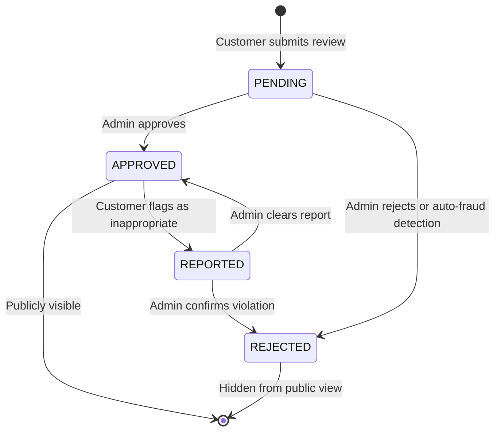
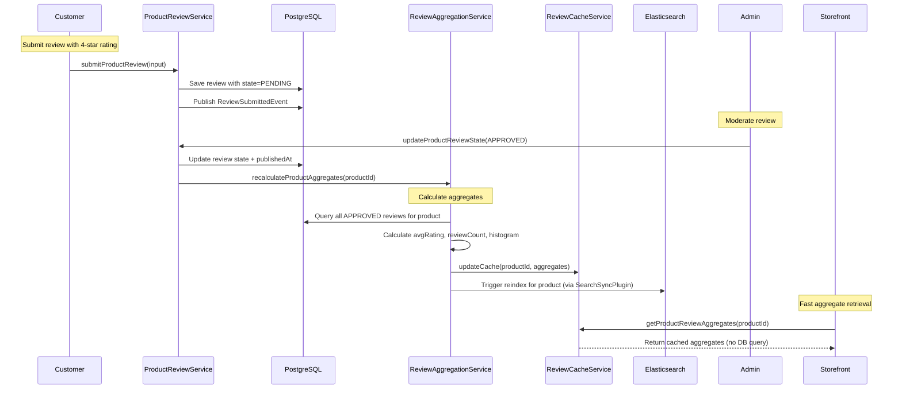

# ⭐ Reviews Plugin for Vendure

> **Plugin Path:** `src/plugins/reviews`  
> **Status:** ✅ Production-Ready | **Compatibility:** Vendure 3.5.x | **Type:** Social Proof Engine

A production-grade product review and rating system for the Buylits multi-vendor marketplace. Provides review submission, moderation workflow, rating aggregation, anti-fraud measures, and seller-specific review analytics with full admin UI integration.

---

## 🎯 Overview

The Reviews Plugin enables trusted social proof for marketplace products through:

| Feature | Description |
|---------|-------------|
| **Review Submission Workflow** | Customers submit reviews with ratings, titles, body text, and optional photos |
| **Moderation Pipeline** | Reviews enter `PENDING` state and require admin approval before public display |
| **Rating Aggregation** | Automatic calculation of average rating, review counts, and star distribution histograms |
| **Purchase Verification** | Optional flag to require verified purchase before allowing review submission |
| **Anti-Fraud Measures** | Rate limiting, duplicate detection, and suspicious pattern flagging |
| **Review Voting** | Customers can upvote/downvote helpful reviews to surface quality content |
| **Seller Analytics** | Per-seller review metrics, response rates, and reputation scoring |
| **Review Requests** | Automated post-delivery email requests to encourage review submission |
| **Admin UI Management** | Full moderation dashboard with bulk actions, filtering, and response tools |
| **Event-Driven Architecture** | Publishes review events for downstream plugin integration (cashback, promotions) |

---

## 🏗️ Architecture

### Core Components

```
reviews/
├── api/
│   ├── product-review-admin.resolver.ts   # Admin: review moderation, bulk actions
│   ├── product-review-shop.resolver.ts    # Shop: review submission, public queries
│   ├── review-upload.controller.ts        # File upload endpoint for review images
│   └── api-extensions.ts                  # GraphQL schema extensions
├── entities/
│   ├── product-review.entity.ts           # Main review entity with rating, state, author
│   ├── review-request.entity.ts           # Tracks automated review request emails
│   ├── review-report.entity.ts            # Customer-reported inappropriate reviews
│   ├── review-reward.entity.ts            # Tracks incentives given for reviews
│   └── review-vote.entity.ts              # Customer upvotes/downvotes on reviews
├── services/
│   ├── product-review.service.ts          # Core CRUD + moderation logic
│   ├── review-request.service.ts          # Automated review request scheduling/sending
│   ├── review-aggregation.service.ts      # Rating calculation + histogram generation
│   ├── review-cache.service.ts            # Cached aggregates for fast product page loads
│   ├── review-email.service.ts            # Review request email templates + sending
│   ├── review-reward.service.ts           # Incentive management (points, coupons)
│   ├── review-report.service.ts           # Abuse report handling + moderation queue
│   └── review-anti-fraud.service.ts       # Rate limiting, duplicate detection, pattern analysis
├── events/
│   └── review.events.ts                   # ReviewSubmittedEvent, ReviewApprovedEvent, etc.
├── listeners/
│   ├── review-event.listener.ts           # Listens to review events for downstream actions
│   └── review-request.listener.ts         # Listens to OrderStateTransition for review requests
├── ui/
│   ├── components/
│   │   ├── all-product-reviews-list/      # Admin: global review moderation table
│   │   ├── product-review-detail/         # Admin: single review detail + moderation actions
│   │   ├── product-reviews-list/          # Admin: product-specific review list
│   │   ├── review-count-link/             # Admin: product list review count badge
│   │   ├── review-histogram/              # Admin: star distribution visualization
│   │   ├── review-state-label/            # Admin: status badge component
│   │   ├── star-rating/                   # Shared: interactive star rating input/display
│   │   └── featured-review-selector/      # Admin: select featured review for product page
│   ├── widgets/
│   │   └── reviews-widget/                # Admin: embedded review summary on product detail
│   ├── providers.ts                       # Nav menu + page tab registration
│   ├── routes.ts                          # Angular route configuration
│   └── reviews.module.ts                  # Angular module exports
├── constants.ts                           # Permissions, DI tokens, event names
├── types.ts                               # Shared TypeScript interfaces + GraphQL types
├── reviews-plugin.ts                      # Plugin bootstrap & configuration
└── index.ts                               # Public API exports
```

### Review Lifecycle State Machine



### Rating Aggregation Flow



> **Invariant:** `ProductReview` = source of truth · `ReviewCacheService` = read-optimized cache · `Elasticsearch` = searchable index with rating facets

---

## 📦 Installation & Setup

### 1. Add to `vendure-config.ts`

```ts
import { ReviewsPlugin } from './plugins/reviews';

export const config: VendureConfig = {
  // ...
  plugins: [
    // Load ReviewsPlugin after core plugins
    ReviewsPlugin.init({
      // Review submission configuration
      submission: {
        // Require verified purchase to submit review
        requireVerifiedPurchase: true,
        // Minimum order state before review request is sent
        minOrderStateForRequest: 'Delivered',
        // Allow anonymous reviews (not recommended for marketplaces)
        allowAnonymous: false,
      },
      
      // Moderation configuration
      moderation: {
        // Auto-approve reviews from verified buyers with high rating
        autoApproveVerifiedHighRating: false,
        // Auto-reject reviews with suspicious patterns (all caps, spam keywords)
        enableAutoFraudDetection: true,
        // Require admin approval for all reviews by default
        defaultState: 'PENDING',
      },
      
      // Aggregation caching configuration
      cache: {
        // TTL for review aggregate cache in milliseconds
        aggregateTtlMs: 5 * 60 * 1000, // 5 minutes
        // Enable Redis-backed distributed cache (recommended for production)
        useRedis: process.env.NODE_ENV === 'production',
      },
      
      // Review request configuration
      requests: {
        // Enable automated post-delivery review requests
        enabled: true,
        // Delay after order delivery before sending request (hours)
        delayHoursAfterDelivery: 24,
        // Max number of review requests per customer per day
        maxRequestsPerCustomerPerDay: 3,
      },
      
      // Anti-fraud configuration
      antiFraud: {
        // Rate limit: max reviews per customer per hour
        maxReviewsPerCustomerPerHour: 5,
        // Block reviews with excessive capitalization (>80% caps)
        blockExcessiveCaps: true,
        // Block reviews with spam keywords (configurable list)
        spamKeywords: ['free', 'winner', 'click here', 'http'],
      },
      
      // Enable verbose logging for debugging
      debug: process.env.NODE_ENV === 'development',
    }),
  ],
  
  // Custom fields on Product entity (auto-registered by plugin)
  // No manual declaration needed - plugin handles this in configuration() hook
  // The following fields are auto-registered:
  // - reviewRating (float, nullable) - average rating for product
  // - reviewCount (float, default 0) - count of approved reviews
};
```

### 2. Database Migration

The plugin registers five entities:

```ts
// reviews-plugin.ts
entities: [
  ProductReview,
  ReviewRequest,
  ReviewReport,
  ReviewReward,
  ReviewVote,
],
```

Run migrations:
```bash
npx vendure migrate
```

### 3. Email Plugin Configuration (Optional)

For automated review requests to work, ensure the Vendure EmailPlugin is configured:

```ts
// vendure-config.ts
import { EmailPlugin } from '@vendure/email-plugin';

EmailPlugin.init({
  // ... your email config
  templateLoader: new FileBasedTemplateLoader(path.join(__dirname, 'email-templates')),
  handlers: [
    // Add review request handler
    {
      handler: 'review-request',
      description: 'Sent to customers after delivery to request a product review',
      from: '"Buylits" <noreply@buylits.com>',
      subject: 'How was your {{productName}}? Share your review! ⭐',
      templateVars: {
        productName: (event) => event.productName,
        productUrl: (event) => event.productUrl,
        reviewUrl: (event) => event.reviewUrl,
        customerName: (event) => event.customerName,
      },
    },
  ],
}),
```

### 4. Elasticsearch Configuration

Ensure `es9-config/es9.ts` includes review fields for faceted search:

```ts
// es9-config/es9.ts - customProductMappings
customProductMappings: {
  // ... other mappings
  // Review aggregates (projected by ReviewAggregationService)
  reviewRating: {
    type: 'float',
    public: true, // Exposed in Shop API for filtering/sorting
  },
  reviewCount: {
    type: 'integer',
    public: true,
  },
},

// In mapQuery function - enable review-based filtering
if (input?.reviewRating?.min != null || input?.reviewRating?.max != null) {
  filters.push({
    range: {
      'product.reviewRating': {
        gte: input.reviewRating?.min ?? 0,
        lte: input.reviewRating?.max ?? 5,
      },
    },
  });
}
```

---

## ⚙️ Configuration

```ts
export interface ReviewsPluginOptions {
  /**
   * Review submission configuration
   */
  submission?: {
    /**
     * Require verified purchase to submit review
     * @default true
     */
    requireVerifiedPurchase?: boolean;
    
    /**
     * Minimum order state before review request is sent
     * @default 'Delivered'
     */
    minOrderStateForRequest?: string;
    
    /**
     * Allow anonymous reviews (not recommended for marketplaces)
     * @default false
     */
    allowAnonymous?: boolean;
  };

  /**
   * Moderation configuration
   */
  moderation?: {
    /**
     * Auto-approve reviews from verified buyers with rating >= threshold
     * @default false
     */
    autoApproveVerifiedHighRating?: boolean;
    
    /**
     * Rating threshold for auto-approval (1-5)
     * @default 4
     */
    autoApproveRatingThreshold?: number;
    
    /**
     * Enable auto-fraud detection for suspicious reviews
     * @default true
     */
    enableAutoFraudDetection?: boolean;
    
    /**
     * Default state for new reviews
     * @default 'PENDING'
     */
    defaultState?: 'PENDING' | 'APPROVED';
  };

  /**
   * Aggregation caching configuration
   */
  cache?: {
    /**
     * TTL for review aggregate cache in milliseconds
     * @default 300000 (5 minutes)
     */
    aggregateTtlMs?: number;
    
    /**
     * Enable Redis-backed distributed cache
     * @default false (in-memory only)
     */
    useRedis?: boolean;
  };

  /**
   * Review request configuration
   */
  requests?: {
    /**
     * Enable automated post-delivery review requests
     * @default true
     */
    enabled?: boolean;
    
    /**
     * Delay after order delivery before sending request (hours)
     * @default 24
     */
    delayHoursAfterDelivery?: number;
    
    /**
     * Max number of review requests per customer per day
     * @default 3
     */
    maxRequestsPerCustomerPerDay?: number;
  };

  /**
   * Anti-fraud configuration
   */
  antiFraud?: {
    /**
     * Max reviews a customer can submit per hour
     * @default 5
     */
    maxReviewsPerCustomerPerHour?: number;
    
    /**
     * Block reviews with excessive capitalization (>X% caps)
     * @default true
     */
    blockExcessiveCaps?: boolean;
    
    /**
     * Capitalization threshold (0-100)
     * @default 80
     */
    excessiveCapsThreshold?: number;
    
    /**
     * Keywords that trigger spam detection
     * @default ['free', 'winner', 'click here', 'http']
     */
    spamKeywords?: string[];
  };

  /**
   * Enable verbose logging for debugging
   * @default false
   */
  debug?: boolean;
}
```

---

## 🔌 API Reference

### Admin GraphQL Extensions

| Query/Mutation | Description | Permission |
|----------------|-------------|------------|
| `productReviews(options)` | List reviews with filtering by product, state, rating | `ReadProductReview` |
| `productReview(id)` | Get detailed review info with author, product, votes | `ReadProductReview` |
| `updateProductReviewState(input)` | Approve/reject a pending review | `ManageProductReviews` |
| `deleteProductReview(id)` | Permanently delete a review | `ManageProductReviews` |
| `featureProductReview(input)` | Mark a review as featured for product page | `ManageProductReviews` |
| `productReviewAggregates(productId)` | Get cached rating aggregates for a product | `ReadProductReview` |
| `reviewReports(options)` | List customer-reported reviews for moderation | `ManageProductReviews` |
| `resolveReviewReport(input)` | Resolve a report (approve/reject review) | `ManageProductReviews` |

### Shop GraphQL Extensions

| Query/Mutation | Description | Authentication |
|----------------|-------------|---------------|
| `productReviewsForProduct(productId, options)` | Get approved reviews for a product (public) | None |
| `productReviewAggregates(productId)` | Get rating summary for product page display | None |
| `submitProductReview(input)` | Submit a new review for a purchased product | Required |
| `voteOnReview(input)` | Upvote/downvote a review for helpfulness | Required |
| `reportReview(input)` | Report inappropriate review content | Required |
| `myReviewRequests` | List pending review requests for authenticated customer | Required |
| `submitReviewFromRequest(input)` | Submit review via automated request link | Token-based (no auth required) |

### Example: Submit Product Review (Shop API)

```graphql
mutation SubmitProductReview($input: SubmitProductReviewInput!) {
  submitProductReview(input: $input) {
    ... on ProductReview {
      id
      rating
      title
      body
      state
      createdAt
      product {
        id
        name
        featuredAsset {
          preview
        }
      }
      author {
        firstName
        lastName
      }
    }
    ... on ErrorResult {
      errorCode
      message
    }
    ... on VerificationRequiredError {
      message
    }
  }
}
```

### Example: Get Product Review Aggregates (Shop API - Public)

```graphql
query GetProductReviewSummary($productId: ID!) {
  productReviewAggregates(productId: $productId) {
    averageRating
    totalReviewCount
    ratingDistribution {
      stars
      count
    }
    featuredReview {
      id
      title
      body
      rating
      author {
        firstName
      }
    }
  }
}
```

### Example: Moderate Review (Admin API)

```graphql
mutation ApproveReview($reviewId: ID!) {
  updateProductReviewState(input: {
    reviewId: $reviewId
    state: APPROVED
    moderatorNote: "Verified purchase, helpful content"
  }) {
    ... on ProductReview {
      id
      state
      publishedAt
      moderatorNote
    }
    ... on ErrorResult {
      errorCode
      message
    }
  }
}
```

---

## 📡 Event System

### Outgoing Events (Published)

| Event | Payload Highlights | Consumers |
|-------|-------------------|-----------|
| `ReviewSubmittedEvent` | `{ ctx, reviewId, productId, customerId, rating }` | `CashbackPlugin` (reward incentives), `SellerPromotionPlugin` (social proof analytics) |
| `ReviewApprovedEvent` | `{ ctx, reviewId, productId, rating, publishedAt }` | `SearchSyncPlugin` (trigger product reindex for rating facets), `NotificationPlugin` (seller alert) |
| `ReviewReportedEvent` | `{ ctx, reviewId, reporterId, reason }` | Moderation dashboard, abuse monitoring systems |
| `ReviewRequestSentEvent` | `{ ctx, customerId, productId, requestId }` | Analytics tracking, request optimization |

> 💡 All events are published via Vendure `EventBus` for loose coupling. Downstream plugins subscribe without tight dependencies.

---

## 🖥️ Admin UI Integration

The plugin extends the Vendure Admin UI with comprehensive review management:

### Navigation & Components

| Location | Component | Purpose |
|----------|-----------|---------|
| `Catalog` → `Product Reviews` | `AllProductReviewsListComponent` | Global moderation dashboard with filtering by state, rating, product |
| `Product Detail` → `Reviews` tab | `ProductReviewsListComponent` | Product-specific review list with bulk moderation actions |
| `Review Detail` → `Actions` | `ProductReviewDetailComponent` | Single review detail with approve/reject buttons, author info, vote stats |
| `Product List` → Review count column | `ReviewCountLinkComponent` | Clickable badge showing review count + average rating |
| `Product Detail` → `Featured Review` | `FeaturedReviewSelectorComponent` | Select which approved review to highlight on storefront |

### Review Moderation Dashboard Features

- Filter by state (`PENDING`, `APPROVED`, `REJECTED`, `REPORTED`)
- Filter by rating (1-5 stars), product, seller, or date range
- Bulk actions: approve multiple pending reviews, reject spam, export to CSV
- Inline moderation: approve/reject without navigating to detail page
- Review content preview with expandable body text

### Star Rating Component (Reusable)

```html
<!-- star-rating.component.html -->
<div class="star-rating" [class.readonly]="readonly">
  <ng-container *ngFor="let star of [1,2,3,4,5]">
    <clr-icon 
      [shape]="star <= value ? 'star' : 'star-outline'"
      [class.star-filled]="star <= value"
      (click)="!readonly && onStarClick(star)"
      class="star-icon"
    ></clr-icon>
  </ng-container>
  <span class="rating-value" *ngIf="showValue">{{ value.toFixed(1) }}</span>
</div>
```

Features:
- Interactive input mode for review submission forms
- Read-only display mode for product pages and admin lists
- Accessible keyboard navigation and ARIA labels
- Configurable decimal precision for average ratings

### Review Histogram Visualization

```graphql
# Query for histogram data
query GetReviewHistogram($productId: ID!) {
  productReviewAggregates(productId: $productId) {
    ratingDistribution {
      stars # 1, 2, 3, 4, or 5
      count # number of reviews with this rating
    }
  }
}
```

Displays as horizontal bar chart showing distribution of ratings, helping customers quickly assess product quality.

---

## 🔗 Integration Points

| Plugin | Integration Type | Details |
|--------|-----------------|---------|
| `SearchSyncPlugin` | Event Consumer | Listens to `ReviewApprovedEvent` → triggers scoped reindex for product rating facets |
| `CashbackPlugin` | Event Consumer | `ReviewSubmittedEvent` can trigger reward incentives for verified buyers |
| `SellerPromotionPlugin` | Data Enrichment | Review counts/ratings included in seller analytics and promotion eligibility |
| `MultivendorPlugin` | Context Enrichment | Reviews include seller information for multi-vendor marketplace context |
| `EmailPlugin` | Delivery Mechanism | Sends automated review request emails post-delivery |
| `ElasticsearchPlugin` | Index Consumer | Uses `reviewRating` and `reviewCount` fields for faceted search and sorting |

### Critical Integration: Elasticsearch Rating Facets

The plugin enables review-based search filtering:

```ts
// es9-config/es9.ts - mapQuery function
if (input?.reviewRating?.min != null || input?.reviewRating?.max != null) {
  filters.push({
    range: {
      'product.reviewRating': {
        gte: input.reviewRating?.min ?? 0,
        lte: input.reviewRating?.max ?? 5,
      },
    },
  });
}

// Enable sorting by rating
if (input?.sort === 'rating-desc') {
  sort = [{ 'product.reviewRating': { order: 'desc', unmapped_type: 'float' } }];
}
```

> 🎯 **Design Intent**: Review aggregates are projected to `Product.customFields` for fast Elasticsearch filtering, while detailed review content remains in PostgreSQL for moderation workflow.

---

## 🛡️ Permissions & Security

| Permission | Scope | Usage |
|------------|-------|---------|
| `ReadProductReview` | Global | View reviews in admin UI and analytics |
| `ManageProductReviews` | Global | Approve/reject reviews, delete content, manage reports |
| `SuperAdmin` | Global | Override moderation decisions, bulk operations |

Custom permissions are auto-registered:

```ts
// reviews-plugin.ts
configuration: (config) => {
  config.authOptions.customPermissions = [
    ...(config.authOptions.customPermissions ?? []),
    {
      name: 'ReadProductReview',
      description: 'View product reviews and aggregates in admin UI',
    },
    {
      name: 'ManageProductReviews',
      description: 'Moderate product reviews: approve, reject, delete, feature',
    },
  ];
  return config;
}
```

### Anti-Fraud Implementation

```ts
// review-anti-fraud.service.ts - detectSuspiciousPatterns
private detectSuspiciousPatterns(input: SubmitReviewInput): string[] {
  const flags: string[] = [];
  
  // Check for excessive capitalization
  if (this.options.antiFraud?.blockExcessiveCaps) {
    const capsRatio = (input.body.match(/[A-Z]/g) || []).length / input.body.length;
    if (capsRatio > (this.options.antiFraud.excessiveCapsThreshold ?? 80) / 100) {
      flags.push('EXCESSIVE_CAPS');
    }
  }
  
  // Check for spam keywords
  const keywords = this.options.antiFraud?.spamKeywords ?? [];
  const bodyLower = input.body.toLowerCase();
  if (keywords.some(kw => bodyLower.includes(kw.toLowerCase()))) {
    flags.push('SPAM_KEYWORDS');
  }
  
  // Check for URL patterns in non-verified reviews
  if (!input.verifiedPurchase && /https?:\/\//.test(input.body)) {
    flags.push('UNVERIFIED_WITH_URL');
  }
  
  return flags;
}
```

### Purchase Verification Logic

```ts
// product-review.service.ts - verifyPurchaseEligibility
async verifyPurchaseEligibility(ctx: RequestContext, customerId: ID, productId: ID): Promise<boolean> {
  if (!this.options.submission?.requireVerifiedPurchase) {
    return true; // Anonymous/unverified reviews allowed
  }
  
  // Check if customer has a delivered order containing this product
  const orderLines = await this.connection.getRepository(ctx, OrderLine)
    .createQueryBuilder('line')
    .leftJoin('line.order', 'order')
    .leftJoin('line.productVariant', 'variant')
    .leftJoin('variant.product', 'product')
    .where('order.customer.id = :customerId', { customerId })
    .andWhere('product.id = :productId', { productId })
    .andWhere('order.state = :state', { state: 'Delivered' })
    .getCount();
  
  return orderLines > 0;
}
```

---

## 📝 Business Rules & Edge Cases

### 1. Review Submission Validation

A review can only be submitted if:

- ✅ Customer is authenticated (unless `allowAnonymous: true`)
- ✅ Product exists and is active
- ✅ Verified purchase requirement is met (if enabled)
- ✅ Rate limit not exceeded (`maxReviewsPerCustomerPerHour`)
- ✅ Content passes anti-fraud checks (no spam keywords, excessive caps)
- ✅ No duplicate review exists for same product + customer

### 2. Rating Aggregation Calculation

```ts
// review-aggregation.service.ts - calculateAggregates
async calculateAggregates(ctx: RequestContext, productId: ID): Promise<ReviewAggregates> {
  const reviews = await this.connection.getRepository(ctx, ProductReview)
    .createQueryBuilder('review')
    .where('review.productId = :productId', { productId })
    .andWhere('review.state = :state', { state: 'APPROVED' })
    .select(['review.rating'])
    .getMany();
  
  if (reviews.length === 0) {
    return {
      averageRating: null,
      totalReviewCount: 0,
      ratingDistribution: [1,2,3,4,5].map(stars => ({ stars, count: 0 })),
    };
  }
  
  // Calculate average with 1 decimal precision
  const sum = reviews.reduce((acc, r) => acc + r.rating, 0);
  const average = Math.round((sum / reviews.length) * 10) / 10;
  
  // Build histogram distribution
  const distribution = [1,2,3,4,5].map(stars => ({
    stars,
    count: reviews.filter(r => Math.round(r.rating) === stars).length,
  }));
  
  return {
    averageRating: average,
    totalReviewCount: reviews.length,
    ratingDistribution: distribution,
  };
}
```

### 3. Review Request Scheduling Logic

```ts
// review-request.service.ts - scheduleReviewRequest
async scheduleReviewRequest(ctx: RequestContext, input: CreateReviewRequestInput): Promise<ReviewRequest> {
  // Check rate limit: max requests per customer per day
  const today = new Date();
  today.setHours(0, 0, 0, 0);
  
  const todayCount = await this.getRepo(ctx).count({
    where: {
      customerId: input.customerId,
      createdAt: MoreThan(today),
    },
  });
  
  if (todayCount >= (this.options.requests?.maxRequestsPerCustomerPerDay ?? 3)) {
    throw new UserInputError('Review request limit reached for today');
  }
  
  // Calculate scheduled send time
  const scheduledAt = new Date(input.scheduledAt ?? Date.now());
  if (!input.scheduledAt) {
    // Default: delayHoursAfterDelivery from order delivery time
    scheduledAt.setHours(scheduledAt.getHours() + (this.options.requests?.delayHoursAfterDelivery ?? 24));
  }
  
  // Create review request record
  return await this.getRepo(ctx).save({
    customerId: input.customerId,
    productId: input.productId,
    orderId: input.orderId,
    orderLineId: input.orderLineId,
    scheduledAt,
    expiresAt: new Date(Date.now() + 30 * 24 * 60 * 60 * 1000), // 30-day expiry
    channelId: input.channelId,
    isIncentivized: input.isIncentivized ?? false,
    status: 'SCHEDULED',
  });
}
```

### 4. Featured Review Selection

Only one review can be featured per product, with priority rules:

1. Must be in `APPROVED` state
2. Prefer reviews with high helpfulness votes (upvotes - downvotes)
3. Prefer reviews from verified purchasers
4. Prefer recent reviews (within last 90 days)
5. Fallback to highest-rated review

```ts
// product-review.service.ts - selectFeaturedReview
async selectFeaturedReview(ctx: RequestContext, productId: ID): Promise<ProductReview | null> {
  return await this.connection.getRepository(ctx, ProductReview)
    .createQueryBuilder('review')
    .leftJoin('review.votes', 'vote')
    .where('review.productId = :productId', { productId })
    .andWhere('review.state = :state', { state: 'APPROVED' })
    .addSelect('COUNT(CASE WHEN vote.isUpvote THEN 1 END) - COUNT(CASE WHEN vote.isUpvote = false THEN 1 END)', 'helpfulness')
    .groupBy('review.id')
    .orderBy('review.isFeatured', 'DESC') // Already featured reviews first
    .addOrderBy('helpfulness', 'DESC')
    .addOrderBy('review.verifiedPurchase', 'DESC')
    .addOrderBy('review.createdAt', 'DESC')
    .limit(1)
    .getOne();
}
```

---

## 🐛 Troubleshooting

| Issue | Diagnostic Steps | Solution |
|-------|-----------------|----------|
| Reviews not appearing on storefront | 1. Check review state is `APPROVED`<br>2. Verify `ReviewCacheService` cache TTL<br>3. Confirm Elasticsearch reindex completed after approval | Enable `debug: true` to log cache hits/misses; manually trigger reindex via `SearchSyncPlugin` mutation |
| Review requests not sending | 1. Confirm EmailPlugin is configured with `review-request` handler<br>2. Check `requests.enabled` config<br>3. Review cron job scheduling in worker process | Verify worker process is running; check email handler registration; test with `delayHoursAfterDelivery: 0` for immediate sending |
| Rating aggregates not updating | 1. Check `ReviewAggregationService` logs for calculation errors<br>2. Verify `ReviewCacheService` invalidation on review approval<br>3. Confirm database triggers or subscribers are active | Run manual aggregate recalculation via admin mutation; check `aggregateTtlMs` config for cache staleness |
| Anti-fraud blocking legitimate reviews | 1. Review `spamKeywords` list for false positives<br>2. Check `excessiveCapsThreshold` value<br>3. Examine flagged review content in logs | Adjust anti-fraud thresholds; add exception list for trusted customers; implement manual override workflow |
| Duplicate reviews from same customer | 1. Verify `verifyPurchaseEligibility` logic<br>2. Check database unique constraints on `(productId, authorId)`<br>3. Review submission validation in service | Ensure unique index exists; add application-level duplicate check before insert; log submission attempts for debugging |

### Debug Mode

Enable verbose review logging:

```ts
// vendure-config.ts
ReviewsPlugin.init({
  debug: process.env.NODE_ENV === 'development',
})
```

Logs appear under `[ReviewsPlugin]` with review IDs, moderation actions, and aggregate calculation details.

### Health Checks

The plugin exposes a reviews health endpoint:

```ts
// GET /health/reviews
{
  "status": "ok",
  "checks": {
    "entitiesRegistered": true,
    "aggregationCacheHealthy": true,
    "reviewRequestSchedulerActive": true,
    "antiFraudRulesLoaded": true,
    "emailHandlerConfigured": true
  }
}
```

---

## 🧪 Testing

### Unit Tests

```bash
# Run reviews plugin tests
npm run test -- reviews-plugin

# Watch mode for aggregation service
npm run test:watch -- review-aggregation.service
```

### E2E Test Scenarios

The plugin includes test suites for:

1. **Review Submission** – Verified purchase validation, anti-fraud checks, duplicate prevention
2. **Moderation Workflow** – PENDING → APPROVED/REJECTED transitions with event emission
3. **Rating Aggregation** – Average calculation, histogram generation, cache invalidation
4. **Review Requests** – Scheduling, sending, expiration, and incentive tracking
5. **Anti-Fraud Detection** – Spam keyword blocking, capitalization checks, rate limiting
6. **Admin UI Integration** – Bulk moderation, filtering, and featured review selection

Example test:
```ts
// reviews.e2e-spec.ts
it('should calculate correct rating aggregates after review approval', async () => {
  const product = await createTestProduct({ sellerId });
  const customer = await createAuthenticatedCustomer();
  
  // Submit and approve three reviews with ratings 5, 4, 3
  const review1 = await submitAndApproveReview({ productId: product.id, customerId: customer.id, rating: 5 });
  const review2 = await submitAndApproveReview({ productId: product.id, customerId: customer.id, rating: 4 });
  const review3 = await submitAndApproveReview({ productId: product.id, customerId: customer.id, rating: 3 });
  
  // Wait for aggregation cache to update
  await sleep(1000);
  
  // Query aggregates via Shop API (public endpoint)
  const aggregates = await getProductReviewAggregates(product.id, { auth: false });
  
  expect(aggregates.averageRating).toBe(4.0); // (5+4+3)/3 = 4.0
  expect(aggregates.totalReviewCount).toBe(3);
  expect(aggregates.ratingDistribution).toEqual([
    { stars: 1, count: 0 },
    { stars: 2, count: 0 },
    { stars: 3, count: 1 },
    { stars: 4, count: 1 },
    { stars: 5, count: 1 },
  ]);
});
```

### Anti-Fraud Test

```ts
// anti-fraud.e2e-spec.ts
it('should block review with spam keywords', async () => {
  const customer = await createAuthenticatedCustomer();
  const product = await createTestProduct({ sellerId });
  
  // Attempt to submit review with spam keyword
  const result = await submitProductReview({
    productId: product.id,
    rating: 5,
    title: 'Great product',
    body: 'This is amazing! Click here for free winner prize: http://spam.com',
  }, { customerId: customer.id });
  
  expect(result.errorCode).toBe('FRAUD_DETECTED');
  expect(result.message).toContain('spam keywords');
  
  // Verify review was not created in database
  const reviews = await getProductReviews(product.id);
  expect(reviews.items.length).toBe(0);
});
```

---

## 📊 Monitoring & Observability

### Key Metrics (Prometheus-compatible)

```ts
// Exposed via /metrics when telemetry-plugin is active
reviews_submitted_total{state="pending|approved|rejected"}  # Counter by final state
reviews_approved_total{verified_purchase="true|false"}  # Counter by verification status
review_requests_sent_total{channel="default"}  # Counter: automated requests sent
review_reports_filed_total{reason="inappropriate|spam|other"}  # Counter by report reason
review_aggregation_cache_hits_total  # Counter: cache hits vs misses
review_anti_fraud_blocks_total{reason="spam_keywords|excessive_caps|rate_limit"}  # Counter by block reason
```

### Admin Dashboard Widgets

Pre-built cards for review ops monitoring:

- **Pending Reviews Queue**: Count of reviews awaiting moderation
- **Approval Rate (24h)**: % of submitted reviews that were approved
- **Average Rating Trend**: 7-day moving average of product ratings
- **Review Request Conversion**: % of sent requests that resulted in submitted reviews

### Analytics Queries

```graphql
# Get review performance for a seller
query SellerReviewAnalytics($sellerId: ID!, $period: AnalyticsPeriod!) {
  sellerReviewStats(
    sellerId: $sellerId
    period: $period
  ) {
    totalReviewsReceived
    averageRating
    approvalRate
    responseRate # % of reviews seller responded to
    topReviewedProducts {
      productId
      productName
      reviewCount
      averageRating
    }
  }
}

# Track review request effectiveness
query ReviewRequestEffectiveness($period: AnalyticsPeriod!) {
  reviewRequestStats(period: $period) {
    requestsSent
    reviewsSubmitted
    conversionRate
    averageTimeToSubmitHours
    incentivizedVsOrganic {
      incentivizedCount
      organicCount
      incentivizedConversionRate
      organicConversionRate
    }
  }
}
```

---

## 🔄 Migration Guide: From Basic Review Plugin

If migrating from a simple review implementation:

### Breaking Changes

| Legacy Pattern | New Pattern | Migration Step |
|---------------|-------------|---------------|
| Single `ProductReview` entity with no state management | State machine: PENDING → APPROVED/REJECTED | Run migration to set existing reviews to `APPROVED` state; update storefront to only query approved reviews |
| No rating aggregation caching | `ReviewCacheService` with TTL | Deploy cache service; run backfill to pre-populate aggregates for existing products |
| Manual review request emails | Automated `ReviewRequestService` with scheduling | Configure EmailPlugin handler; migrate existing customer purchase data to seed initial review requests |
| No anti-fraud measures | Configurable fraud detection rules | Start with conservative settings (`blockExcessiveCaps: false`); monitor logs and gradually enable protections |
| No seller context in reviews | Multi-vendor review enrichment | Ensure `MultivendorPlugin` is loaded; run backfill to associate existing reviews with seller channels |

### Data Migration Script

```sql
-- Set existing reviews to APPROVED state (assuming they were manually moderated)
UPDATE product_review 
SET state = 'APPROVED', 
    published_at = COALESCE(published_at, created_at),
    moderator_note = 'Migrated from legacy system'
WHERE state IS NULL OR state = '';

-- Pre-populate review aggregates for all products with reviews
INSERT INTO product_review_aggregate_cache (
  product_id, average_rating, total_review_count, rating_distribution, updated_at
)
SELECT 
  product_id,
  AVG(rating) as average_rating,
  COUNT(*) as total_review_count,
  json_agg(json_build_object('stars', stars, 'count', cnt)) as rating_distribution,
  NOW() as updated_at
FROM (
  SELECT 
    product_id,
    ROUND(rating) as stars,
    COUNT(*) as cnt
  FROM product_review
  WHERE state = 'APPROVED'
  GROUP BY product_id, ROUND(rating)
) sub
GROUP BY product_id
ON CONFLICT (product_id) DO UPDATE
SET 
  average_rating = EXCLUDED.average_rating,
  total_review_count = EXCLUDED.total_review_count,
  rating_distribution = EXCLUDED.rating_distribution,
  updated_at = EXCLUDED.updated_at;
```

### Plugin Load Order

Critical: Load plugins in this sequence for proper event handling and data enrichment:

```ts
plugins: [
  // 1. Core Vendure plugins first
  // 2. MultivendorPlugin if used (for seller context in reviews)
  MultivendorPlugin.init({ /* ... */ }),
  
  // 3. ReviewsPlugin after dependencies
  ReviewsPlugin.init({ /* reviews options */ }),
  
  // 4. SearchSyncPlugin to handle reindex on review approval
  SearchSyncPlugin.init({ /* ... */ }),
  
  // 5. EmailPlugin last (for review request handlers)
  EmailPlugin.init({ /* ... */ }),
]
```

---

## 📄 License

MIT © Buylits Marketplace

---

> 🔗 **Part of the Buylits Trust & Safety Stack**  
> This plugin is designed to work seamlessly with:
> - `search-sync` – Triggers reindex when reviews are approved to update rating facets
> - `cashback-plugin` – Rewards customers for submitting verified purchase reviews
> - `seller-promotion-plugin` – Uses review counts/ratings in promotion eligibility and analytics
> - `multivendor-plugin` – Enriches reviews with seller information for marketplace context
> - `email-plugin` – Delivers automated review request emails post-delivery
> 
> Refer to the [Platform README](../../README.md) for end-to-end architecture details and the [Pinelab Webhook Plugin docs](https://github.com/Pinelab-studio/pinelab-vendure-plugins/tree/main/packages/vendure-plugin-webhook) for outbound event patterns.